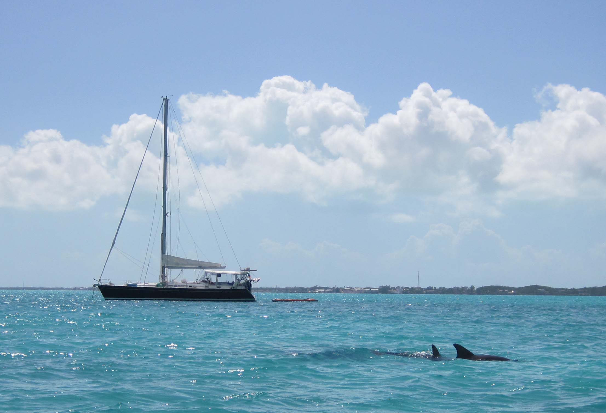

# Lecture 01 - Intro To Class

[https://xkcd.com/353/](https://xkcd.com/353/)

Who is Prof Philip Schlump?

Can you make Money at computer science?

Yes - it pays.  The level of opportunity has never been better.  The opportunity in computer science has never been
bigger.  Computers are eating the world.

What it takes to be successful?  Success is Easy to explain.  Be willing to do what other people are unwilling to do.
How this applies to you - right now.  When you learn to program you are dogging something that most people are unwilling
to do.  Programming is hard.  It is the most difficult computer game ever.  There is never a day that it is "easy".  It
is not a "talent".  It is a "Skill" that you can learn.  It is a process that you can practices and learn.

You practice and you learn to program.   You lean a valuable skill.  This is valuable.  On average a UW graduate will
make $86,200.00 in this field.   You can expect to get raises for about 6 years.  An average of $112,000.00 a year.
Will you make more if you move to NYNY - yep.  Will you make less in Omaha NE - yep.  Cost of living is different in
each location.  The best is if you can get a remote job that pays NYNY pay in Wyoming or Oklahoma.  $110k is top 10% of
income a year - this is $55 an hour.

That is fantastic.  You will not be "rich" by any means.  To create "wealth" you have to move beyond a job and build a
business.  Consulting can pay way more than just a job.  My last consulting gig was 14.5 months at $16,000.00 a month.
If you want to make more than that you need to start and run a successful business.  Don't think that a "successful
business" means just a computer company.   I have a friend in Denver, with a masters in Computer Science from UW that
now owns 9 Great Clips - each making more than $50k per year.  She is no longer doing development work.

In a consulting business I did a contract with Time Warner.  I had 23 folks that I placed with them. On average I made
41.20 and hour for 6 months on each hour of other peoples work.  I leave the math to you.

I built a VC funded product company.  Do you think there were hard times in balding that.  You bet.  At one point I went
out on a trip to sell the software.  We had $38.15 in the bank account.  With a little over $10k due in 2 weeks for
labor.   My CEO and I had not take a pay check in 7 months.  My wife and children had the flue. I returned 12 days later
with a check from a customer for $140,000.00.

After selling the product company I took 11 years off.  My wife and I bought a sailboat - we raised our kits on a boat
on the eat cost and Caribbean.

What about those of you that are not CoSc majors?  86% of all STEM majors end up programming.  That is according to the
Bureau of Labor Statistics.  Depending on your major you may make less than the $86k.

 Image (C) Philip Schlump, 2011.

 Image (C) Philip Schlump, 2010.

Steve Jobs said: “Life can be so much broader, once you discover
one simple fact, and that is that everything around you that you
call ‘life’ was made up by people who were no smarter than you. And
you can change it, you can influence it, you can build your own
things that other people can use. Once you learn that, you’ll never
be the same again.”

## How the Gig economy works

Who is me article in Time: [https://time.com/6085525/big-tech-data-centers/](https://time.com/6085525/big-tech-data-centers/)

1. Jobs  are never permanent.  Contracts have a fixed end date.  Labor laws in us say that a "Contractor" is a "temporary" only if they work for less than 18 months and then have 6 months off.
2. Burdened cost.  At UW it is 1.48 - other people will have 1.52 to 1.58 is common.  So you get a "job" the cost to the business is Pay(gross) * 1.48.  100k a year means that the business cost is 148000 a year.   As a contractor you get X + 148000 per year - but you have to pay your own matching tax, your health insurance, your retirement etc.
3. Big businesses have lots of leverage v.s. small city organizations.
4. Cost of Replacement is very high.  It costs $25k to $50k to hire a new person.
5. Jobs are only worth what the "kind" of a job pays.   If a programmer pays 100k to 105k that is it.  If you as a programmer are way better than others you still get 100k to 105k.   If you want more then you have to get out of the "employee" mentality and build some form of a business.

## Class Overview

1. Tools for programming.  A large proportion of people today view computes as the "user interface" that they get to see.  This is an iPhone, a Google search, a web page, an Instagram post.  When you program you have to have a different view of what a computer is.   You need to step back to Files and Folders and Communication between systems. 
2. Python - our programming language - Why Python ? - then - What is the structure of a program.  Like English it has a grammar, and rules and syntax.   If you learn French it is hard.  To learn a language that is used to communicate between a human and both humans and computes like python is also hard.  It has unusual constructs.
3. Other tools that relate to developing software but can be used outside of the "programming" field - like "git".
4. Programming as a *super* power - how and why computer programs can make a difference.
5. Machine learning - and a touch of economics.

One common thread (and there will be a number of these) in this class is that useful programs work outside of the field of computer science.  Programs for the sake of programs tends to be a rather
un-interesting field.  Programs applied to outside data and information - that is interesting.  So we are going to touch on a bunch of different outside fields.

1. Astronomy and the solar system.
2. Biometrics - genetics and biological systems.
3. The Impact of software on ethics and our social fabric.
4. How computers are changing the world.

# Copyright

Copyright (C) University of Wyoming, 2022.

