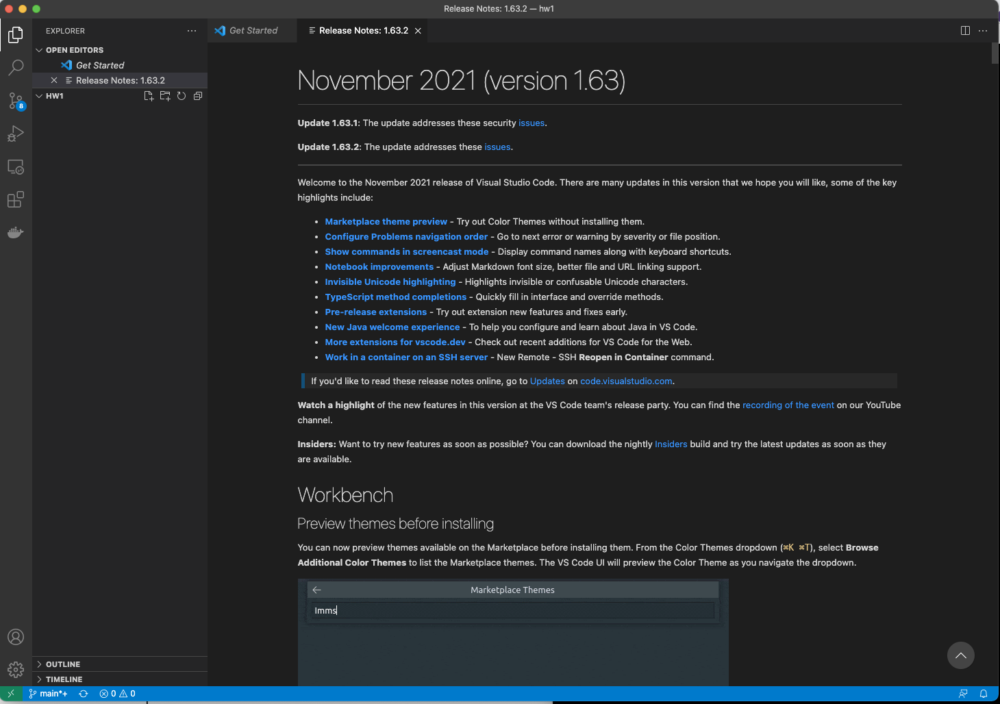
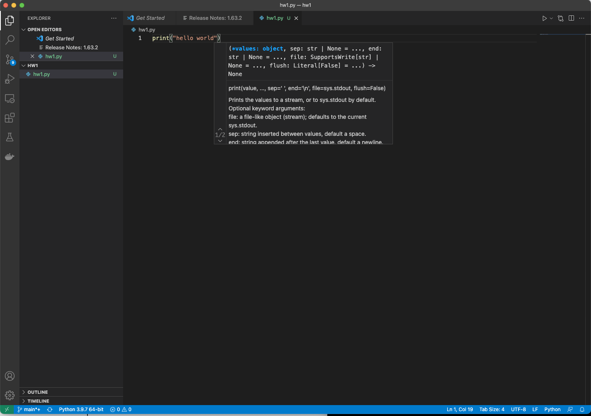
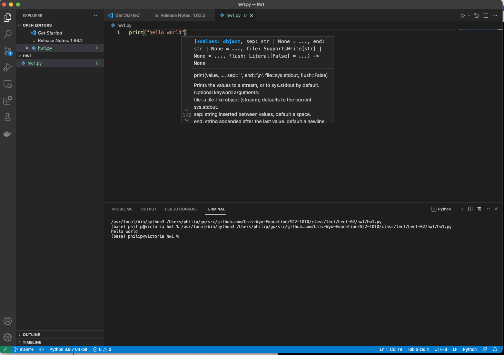

m4_include(../../../setup.m4)

# Lecture 2 - Files and Directories


Back in the dark ages....

What is a file?

What is a directory/folder?

What is a file extension?

How to create a file...

How to edit a file...

How to save a file...

How to open a Project...


On Windows this is the Anaconda Power Shell, on a Mac you can bring up Terminal or iTerm2.

Let's Create a Directory for our first Homework.

```
C:\>
C:\> H:
H:\> mkdir hw1
```

or on a Mac

```
$ mkdir hw1
```


1. This is on this computer - not on some other.  OneDrive.
2. if you are using the uw system (as is this demo) then you do this on the `H:\>` drive.

let's make the current directory our 'default' directory.

```
H:\> cd hw1
```

or

```
$ cd hw1
```


Some commands are "built in" like "cd" others are "found" using a "path".

Now let's bring up "Visual Studio Code" or "VSCode".

```
H:\hw1\> pwd
H:\hw1
H:\hw1\> code .
```

or 

```
$ pwd
/Users/philip/hw1
$ code .
```

This brings up Visual Studio Code in the current directory.



Now we can create a new file, and edit it.



And run the file


