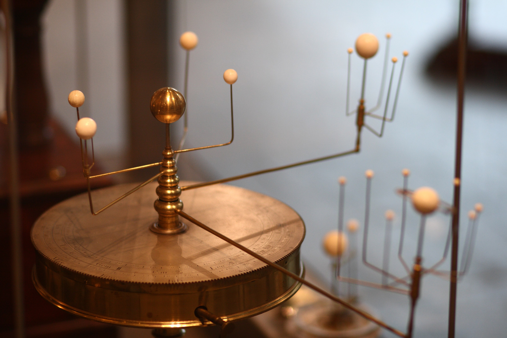

<style>
.pagebreak { page-break-before: always; }
.half { height: 200px; }
</style>
<style>
.pagebreak { page-break-before: always; }
.half { height: 200px; }
.markdown-body {
	font-size: 12px;
}
.markdown-body td {
	font-size: 12px;
}
</style>


# Lecture 4 - Scale model of the solar system and beoynd

Common model of Solar System: <br>


Beautiful model <br>


## Data

Size of the sun:  865,370 miles

Size of the tennis ball: 2.75 inches

91.523 million miles from sun to earth

463.81 million mi - Jupiter to Sun

920.1 million mi - Saturn to Sun

Jupiter/Diameter 86,881 miles

Saturn/Diameter 72,367 miles


```
  1: 
  2: import conv_mi_to_inch
  3: 
  4: sun_in_mi = 865370
  5: tb_in_in = 2.75
  6: earth_in_mi = 7917.5
  7: moon_in_mi = 2159.1
  8: 
  9: sun_in_inch = conv_mi_to_inch.mi_to_inch ( sun_in_mi )
 10: 
 11: print ( "Diameter of Sun in Inches = {}".format(sun_in_inch) )
 12: 
 13: conv_sun_to_tb = sun_in_inch / tb_in_in
 14: 
 15: print ( "Conversion Factor  {}".format(conv_sun_to_tb) )
 16: 
 17: earth_in_inch = conv_mi_to_inch.mi_to_inch ( earth_in_mi )
 18: 
 19: earth_in_tb = earth_in_inch / conv_sun_to_tb 
 20: 
 21: earth_in_tb_1000 = earth_in_tb * 1000
 22: 
 23: print ( "Earth in TB Inches {}".format(earth_in_tb) )
 24: print ( "Earth in TB 1000/th-of-Inches {}".format(earth_in_tb_1000) )
 25: 
 26: moon_in_inch = conv_mi_to_inch.mi_to_inch ( moon_in_mi )
 27: 
 28: moon_in_tb = moon_in_inch / conv_sun_to_tb 
 29: 
 30: moon_in_tb_1000 = moon_in_tb * 1000
 31: 
 32: print ( "Moon in TB Inches {}".format(moon_in_tb) )
 33: print ( "Moon in TB 1000/th-of-Inches {}".format(moon_in_tb_1000) )
 34: 
 35: sirius_in_ly = 8.611
 36: ly_to_mi = 5878612843200
 37: sirius_in_mi = sirius_in_ly * ly_to_mi 
 38: 
 39: sirius_in_inch = conv_mi_to_inch.mi_to_inch ( sirius_in_mi )
 40: 
 41: sirius_in_tb = sirius_in_inch / conv_sun_to_tb 
 42: 
 43: sirius_in_tb_miles = sirius_in_tb / ( 5280 * 12 )
 44: 
 45: print ( "Sirius in TB Units (miles) = {}".format ( sirius_in_tb_miles ) )
 46: 

```

To run this :

```
$ python conv-factor.py
```

To put the output in a file:

```
$ python conv-factor.py > conv-factor.out
```

And the Output:

```
Diameter of Sun in Inches = 54829843200
Conversion Factor  19938124800.0
Earth in TB Inches 0.025160480488114912
Earth in TB 1000/th-of-Inches 25.160480488114914
Moon in TB Inches 0.006861255878988178
Moon in TB 1000/th-of-Inches 6.861255878988178
Sirius in TB Units (miles) = 2538.891480546616
```

Important:

_Conversion Factor  19938124800.0_


```
# inch_to_tb converts from miles as an integer or float to tb.  
def inch_to_tb ( mi ):
    conv = 19938124800
    inch = mi / conv
    return (inch)
```


## How computers represent stuff

At a low level computers represent everything as an electrical signal
that is either on or off.

We collect sets of these electrical signals and usually consider off
to be a 0 and on to be a 1.  (Not always sometimes on is a 0 and off
is a 1).

In sets these on/off values of 0/1 are used to make bigger numbers.
All of this is in base 2.  Base 2 has digits 0 and 1.  Base 10 has 
0 to 9.   Most humans are familiar with base 10 and base 60.
The clock on the wall is base 60 - there are 60 minutes to the hour
and 60 seconds to the minute.  Computers use base 2.

So if I have a base 10 number, let's say 13 then it is going to 
take more 0's and 1's to represent it in binary.

| Base 10 | Base 2   |
|---------|----------|
|     0   | 0 0 0 0  |
|     1   | 0 0 0 1  |
|     2   | 0 0 1 0  |
|     3   | 0 0 1 1  |
|     4   | 0 1 0 0  |
|     5   | 0 1 0 1  |
|     6   | 0 1 1 0  |
|     7   | 0 1 1 1  |
|     8   | 1 0 0 0  |
|     9   | 1 0 0 1  |
|    10   | 1 0 1 0  |
|    11   | 1 0 1 1  |
|    12   | 1 1 0 0  |
|    13   | 1 1 0 0  |
|    14   | 1 1 1 0  |
|    15   | 1 1 1 1  |


Computers only have signals that are on/off - that is it.
So characters are represented as numbers.  The letter 'a'
is encoded as a numeric value.  In the most popular encoding
'a' is a 97 in decimal.  'b' is a 98.  So in a certain way
`'a' + 1 == 'b'`

Bigger numbers require more bits to represent.  The computers
that we commonly use have 64 bits for numbers.  Since lots of
people want to represent negative numbers we take 1 bit and 
make it the sign bit, leaving 63 bits for the number.

Floating point numbers are represented as two parts.
First is the exponent.  The second is the number.  Each
has a sign bit.  Roughly 53 bits are for the number and
11 to 12 bits are for the exponent.

This has lots of implications.

The string "12" is not the same as the integer 12
and is not the same as the float 12.0.


