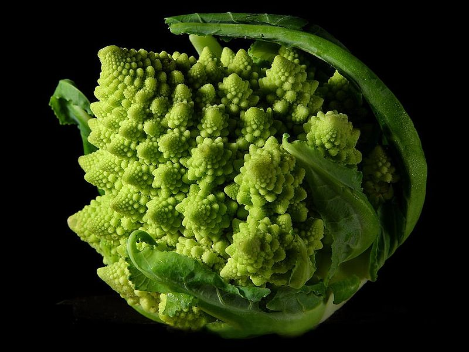
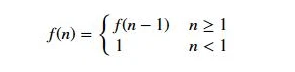

m4_include(../../../setup.m4)

# Lecture 19 - Recursion

Why Recursion?




<div class="pagebreak"></div>

An example of a recursive addition

Let's define the sum of values from 0 to n as

```
    sum(n) = { 0 if n <= 0
             { n + sum(n-1) if n > 0
```

Then we can build a function that matches this.

```
m4_include(r_add.py.nu)
m4_comment([[[
def recursive_sum ( n ):
    if n <= 0:
        return 0
    return n + recursive_sum(n-1)

# Automated Test
if __name__ == "__main__":
    n_err = 0
    x = recursive_sum ( 5 )
    if x !=  15:
        n_err = n_err + 1
        print ( "Error: Test 1: sum not working, expected {} got {}".format (  15, x ) )
    x = recursive_sum ( 0 )
    if x != 0:
        n_err = n_err + 1
        print ( "Error: Test 2: sum conversion not working, expected {} got {}".format ( 0, x ) )

    if n_err == 0 :
        print ( "PASS" )
    else:
        print ( "FAILED" )
]]])
```


What is a recursive function definition:



For a positive initeger:

```
    n! = n * (n-1) * ... * 2 * 1
```

or

```
    f(n) = n * (n-1) * ... * 2 * 1
```

or

```
    f(n) = n * f(n-1)
```

or

```
    f(n) = { n <= 1 : 1
           { n > 1  : n * f(n-1)
```

Now to Code:

```
m4_include(r1.fact.py.nu)
```

Compare to an iterative version:


```
m4_include(i1.fact.py.nu)
```


A better example is a fractal tree:


## Fibonacci Numbers


```
    fib(n) = { 0 : n = 0
             { 1 : n = 1
             { fib(n-1) + fib(n-2)
```


<div class="pagebreak"></div>

## Weed


```
m4_include(tree.py.nu)
```

<div class="pagebreak"></div>

# The Koch curve.

So a program to run the Koch curve:

```
m4_include(koch.py.nu)
```
