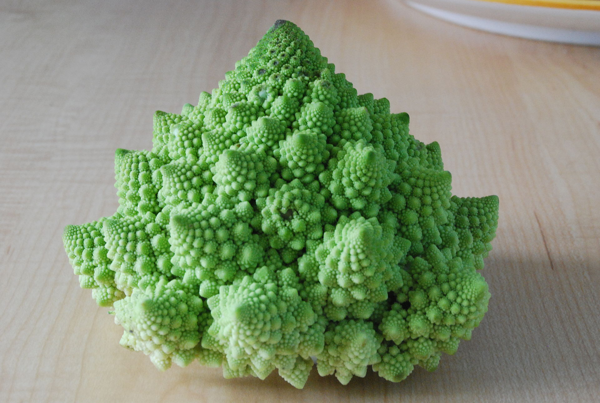
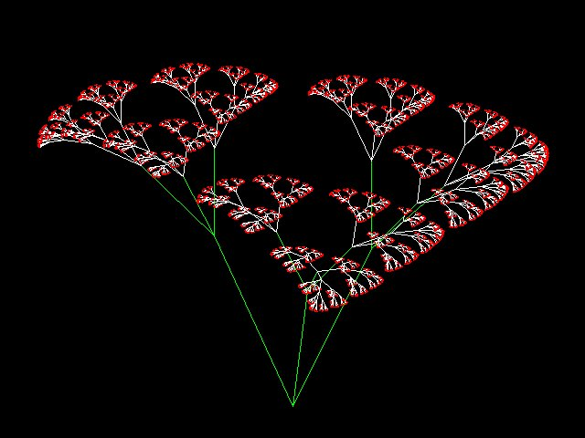
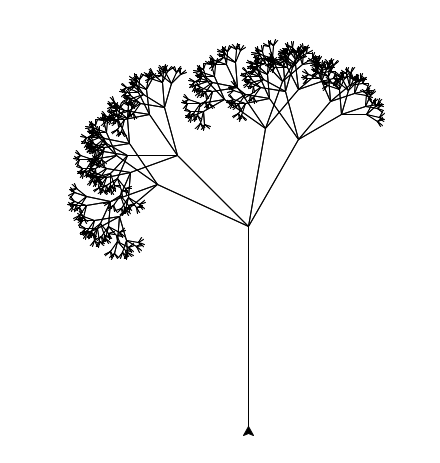
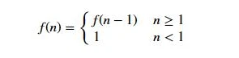
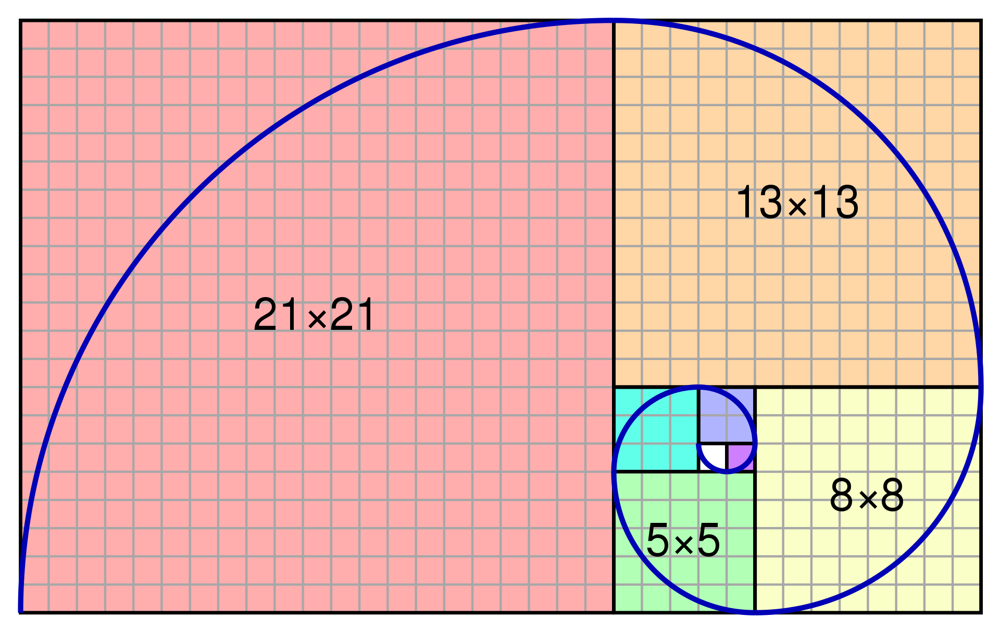

<style>
.pagebreak { page-break-before: always; }
.half { height: 200px; }
</style>
# Lecture 20 - Recursion

Why Recursion?










<div class="pagebreak"></div>

What is a recursive function definition:



For a positive initeger:

```
    n! = n * (n-1) * ... * 2 * 1
```

or

```
    f(n) = n * (n-1) * ... * 2 * 1
```

or

```
    f(n) = n * f(n-1)
```

or

```
    f(n) = { n <= 1 : 1
           { n > 1  : n * f(n-1)
```

Now to Code:

```

def calc_factorial(x):
    # A recursive function to find the factorial of a number
    if x <= 1:
        return 1
    else:
        return (x * calc_factorial(x-1))

if __name__ == "__main__": 
    num = 5
    print("The factorial of", num, "is", calc_factorial(num))        

    err = False
    v = calc_factorial(num) 
    if v != 120:
        err = True
        print ( "Incorrect result: {n}! Expected {good} got {bad}".format(n=num, good=120, bad=v))

    if not err :
        print ( "PASS" )
    else :
        print ( "FAIL" )

```

Compare to an iterative version:


```

def factorial_iterative(x):
    if x <= 1:
        return 1
    nn = 2
    rv = 1
    while ( nn <= x ):
        rv = rv * nn
    return rv

if __name__ == "__main__": 
    num = 5
    print("The factorial of", num, "is", factorial_iterative(num))        

    err = False
    v = factorial_iterative(num) 
    if v != 120:
        err = True
        print ( "Incorrect result: {n}! Expected {good} got {bad}".format(n=num, good=120, bad=v))

    if not err :
        print ( "PASS" )
    else :
        print ( "FAIL" )

```


A better example is a fractal tree:


## Fibonacci Numbers




```
    fib(n) = { 0 : n = 0
             { 1 : n = 1
             { fib(n-1) + fib(n-2)
```


<div class="pagebreak"></div>

## Weed


```
import turtle 

def tree(length,n):
    if length < (length/n):
           return
    turtle.forward(length)
    turtle.left(45)
    tree(length * 0.5,length/n)
    turtle.left(20)
    tree(length * 0.5,length/n)
    turtle.right(75)
    tree(length * 0.5,length/n)
    turtle.right(20)
    tree(length * 0.5,length/n)
    turtle.left(30)
    turtle.backward(length)
    return

turtle.left(90)
turtle.backward(30)
tree(200,4)

input("Press Enter to continue...")

```

<div class="pagebreak"></div>

# The Koch curve.

So a program to run the Koch curve:

```

# Python program to print complete Koch Curve. 
from turtle import *

# function to create koch snowflake or koch curve 
def snowflake(lengthSide, levels): 
    if levels == 0: 
        forward(lengthSide) 
        return
    lengthSide /= 3.0
    snowflake(lengthSide, levels-1) 
    left(60) 
    snowflake(lengthSide, levels-1) 
    right(120) 
    snowflake(lengthSide, levels-1) 
    left(60) 
    snowflake(lengthSide, levels-1) 

# main function 
if __name__ == "__main__": 
    # defining the speed of the turtle 
    speed(0)                 
    length = 300.0

    # Pull the pen up  no drawing when moving. 
    # Move the turtle backward by distance, opposite 
    # to the direction the turtle is headed. 
    # Do not change the turtles heading.         
    penup()                     

    backward(length/2.0) 

    # Pull the pen down  drawing when moving.         
    pendown()         
    for i in range(3):     
        snowflake(length, 4) 
        right(120) 

    # To control the closing windows of the turtle 
    mainloop()     

```


# Copyright

Copyright (C) University of Wyoming, 2019.
