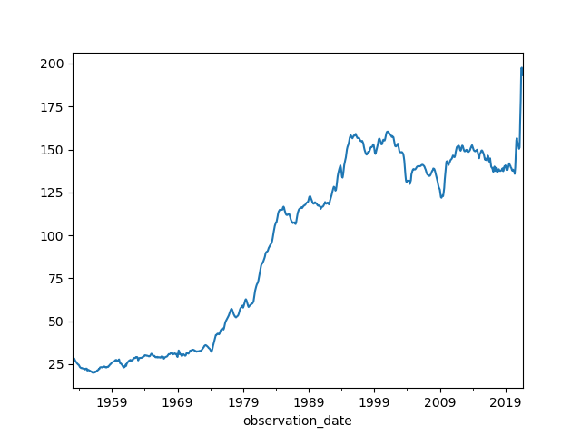

<style>
.pagebreak { page-break-before: always; }
.half { height: 200px; }
</style>
<style>
.pagebreak { page-break-before: always; }
.half { height: 200px; }
.markdown-body {
	font-size: 12px;
}
.markdown-body td {
	font-size: 12px;
}
</style>


# Lecture 15 - Numpy, Pandas, MatPlotLib

## What is NumPy, why NumPy

NumPy  is for "Numerical Python". 
It is a Python module which provides fast mathematical
computation on n-dimensional data.  These are arrays, matrices, 3-D data etc.
Images are 2d data.   Other machine learning data may be n-dimensional.
For this reason NumPy is an essential part of the Machine Learning ecosystem.
In conjunction with Pandas and MatPlotLib these tools will allow us to 
effectively use TensorFlow.   This makes for a complete the Python Machine Learning Ecosystem.

We can build high speed mathematical functions and scientific computation
using the underlying storage in NumPy.

To import NumPy:

```
import numpy as np
```

There is a "install" check script later in this lecture for all 3 modules.

Why not just use Python lists?

A list can be indexed and it looks to be a way to store multi-dimensional 
data.  The problem is that a list is built out of individual nodes.
Individual nodes can have different data types.  This makes lists
flexible but slow.  With lots of data an efficient way to store
homogeneous data is needed.   Lots of work has been put into
NumPy to make it efficient.

## How to use NumPy

<style>
table tbody tr td {
	vertical-align : top;
}
</style>

| NumPy Command | Example |
|:-------------|:-------------------------------------|
| np.array     | <pre><code>>>> z = np.array([5,4,3])<br>>>> print(z)</code></pre> |
| np.ones      | <pre><code>>>> z = np.ones((2,3))<br>>>> print(z)</code></pre> |
| np.full      | <pre><code>>>> z = np.full((2,3),8)<br>>>> print(z)</code></pre> |
| np.reshape   | <pre><code>>> z=np.arange(3).reshape((3,1))<br>>>> print(z)</code></pre> |

## A example of NumPy

On a boat with no gas working gages.

```
  1: # 5g + 17m = 30.5
  2: # 8g + 22m = 41
  3: 
  4: # Can be solved in NumPy using
  5: import numpy as np
  6: 
  7: coeffs  = np.array([[5, 17], [8, 22]])
  8: depvars = np.array([30.5, 41])
  9: solution = np.linalg.solve(coeffs, depvars)
 10: 
 11: # solution
 12: print ( solution )
 13: # array([1, 1.5])
 14: # means g=1, m=1.5 or 1 gallon per hour for generator,
 15: # 1.5 gallon per hour for main moter

```

# Using Vectors with Machine learning


Vectors are one-dimensional arrays. They get used all over the place with machine learning.
Depending on what we are doing we will see both row and column vectors.  If we have the
wrong shape we can use np.reshape to fix it.

A vector is often defined as a magnitude and a direction. In 2d space this means a vector of `[3,30]` can be a force of 3 and a direction of 30-degrees.
This can be useful where we can add up vectors to get a final vector.

In ML they are used to represent observations and predictions.

Let's take a youtube set of videos on van's and van-building and then
analyze the comments on the videos.  We want to classify them as a set
of probabilities.  Is it clickbait, is it useful, is it a travel video.
The Output for a given video might be a vector of `[0.28,0.02,0.41]` where
this is a probability of 28% for being clickbait, 2% for a probability of being
a useful build video and 41% being a travel video.

As a feature vector we may have a set of values that relate to the same videos
like duration, number of views, number of comments, length of comments.

Most of the time for machine learning is spent on collecting and preparing
the data.  This is the 'data' pipeline.  Consideration also needs to take
place on how to test the model and how to maintain it with new data.


## Differences between NumPy arrays and Python Lists.

A sub-section of an array, called a slice, is just a pointer into the original data in NumPy.  In Python it is a copy.
To create a copy with NumPy use the np.copy function.

NumPy:

```
  1: import numpy as np
  2: 
  3: a = np.array([1,2,3,4,5])
  4: print ("original a={}".format( a ))
  5: 
  6: a[1:3] = 200
  7: print ("modified a={}".format( a ))
  8: 
  9: b = np.copy(a[1:3])
 10: print ( "b={}".format(b ))
 11: b[0] = 400
 12: 
 13: print ("again  a={} and b={}".format( a, b ))

```

Python:

```
  1: a = [1,2,3,4,5]
  2: x = a[1:3]
  3: print ( "x={}".format(x))
  4: x[0] = 400
  5: print ( "a={} x={}".format(a,x) )
  6: 
  7: a[1:3] = 200

```


## A quick check that you have all 3 modules installed.

First check that you have them installed.

```
  1: import numpy as np
  2: import pandas as pd
  3: import matplotlib.pyplot as plt
  4: 
  5: print ( "You should not see any errors when this is run" )

```


## Pandas 

Pandas is a widely used system for storage and access of data.  It is an in-memory database
that allows us to combine and select data that we can then use in NumPy as vectors.  The
performance is very good for reasonable size data.   For big data sets you usually end up
using a "database" like "Postgresql".  Many of the concepts in Pandas are the same as
a database and that is a good way to get the concepts for database down.

Data is organized into 2d tables that are very much like a spreadsheet.   They have 
columns that are named and allow for you to access stuff by name.  This 2d set of 
data is called a 'dataframe'.

With Pandas we can do useful analysis like creating pivot tables, summarizing data
from multiple columns into new columns.  It also intracts with MatPlotLib to allow
us to easily polot data.

To Import into Python:

```
>>> import pandas as pd
```

## Common Pandas Data Types

`pd.Series` takes a list and a set of names and converts this into a column that
cat be part of a data frame.

`pd.DataFrame` takes a dictionary of `pd.Series` (columns) and creates a object
that can be selected from and manipulated with a set of columns of named data.

`pd.Panel` creates a dictionary of dataframes.  This would be like the set of
sets that you have in Microsoft Excel.

Every dataframe has named columns of data and indexes for each item.

An example:

```
  1: import pandas as pd
  2: 
  3: people_dict = {
  4:         "weight": pd.Series([145, 182, 191],index=["joan", "bob", "mike"]),  
  5:         "birthyear": pd.Series([2002, 2000, 1999], index=["bob", "joan", "mike"], name="year"),
  6:         "children": pd.Series([1, 2], index=["mike", "bob"]),
  7:         "hobby": pd.Series(["Rock Climbing", "Scuba Diving", "Sailing"], index=["joan", "bob", "mike"]),
  8:         }
  9: 
 10: people = pd.DataFrame(people_dict)
 11: 
 12: print ( people )
 13: 

```

Output

```
      weight  birthyear  children          hobby
bob      182       2002       2.0   Scuba Diving
joan     145       2000       NaN  Rock Climbing
mike     191       1999       1.0        Sailing

```

There is easy inexorability between Pandas and other tools like Comma Separated Value files (CSV), Excel, HTML and SQL Databases.

For example we have some car data.

Converted into a format that is easy for Pandas to consume.

And some code to read it and make a plot.

```
  1: import matplotlib.pyplot as plt
  2: import pandas as pd
  3: # import seaborn as sns
  4: 
  5: # df = pd.read_excel (r'car/CUSR0000SETA02.xls')
  6: df = pd.read_excel (r'car/car-price-data.xls')
  7: df['observation_date'] = pd.to_datetime(df['observation_date'])
  8: print (df)
  9: print (df.info())
 10: 
 11: df.set_index('observation_date')['CUSR0000SETA02'].plot();
 12: 
 13: plt.waitforbuttonpress()

```



Some things from the program:

| Pandas Calls | Description |
|:----------------|-------------------------------------|
| head()          | returns the top 5 rows in the dataframe object |
| info()          | prints the summary of the dataframe |
| describe()      | gives a nice overview of the main aggregated values over each column |
| tail()          | returns the bottom 5 rows in the dataframe |


## MatPlotLib


MatPlotLib is a 2d plotting library that is nicely integrated with Pandas.
You can also use it on it's own.

It can output to the screen, to hard-copy (images).

It is also directly integrated into Jupyter Notebook and has a way to be
used on a website to produce plots.

If you are familiar with MATLAB then `matplotlib.pyplot` will be to your
liking.  It works just like the plotting system in MATLAB.

Plotting a Line Graph:

```
  1: import matplotlib.pyplot as plt
  2: 
  3: plt.plot([1,3,2,4,5,8])
  4: plt.ylabel('A SImple Line Graph')
  5: plt.waitforbuttonpress()
  6: plt.show()

```

Or a bar graph:

```
  1: import matplotlib.pyplot as plt
  2: 
  3: x = [   21,20,23,4,7,
  4:         6,78,8,3,10,
  5:         41,22,53,33,
  6:         31,37,39,12,
  7:         45,30,100]
  8: plt.hist(x, 5, facecolor='green')
  9: plt.waitforbuttonpress()
 10: plt.show()

```

