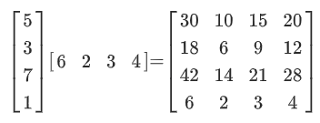

<style>
.pagebreak { page-break-before: always; }
.half { height: 200px; }
</style>
<style>
.pagebreak { page-break-before: always; }
.half { height: 200px; }
.markdown-body {
	font-size: 12px;
}
.markdown-body td {
	font-size: 12px;
}
</style>


# Lecture 16 - tensor flow - math 

What is A "tensor" and how will it "flow"?

In the general definition "tensors" are arrays of numbers organized into an n-dimensional grid.

A scalar is a 1-ish number.  This is the simplest kind of tensor:


```
  1: import tensorflow as tf
  2: 
  3: x = tf.constant(-2.0, name="x", dtype=tf.float32)
  4: a = tf.constant(5.0, name="a", dtype=tf.float32)
  5: b = tf.constant(13.0, name="b", dtype=tf.float32)
  6: 
  7: y = tf.Variable(tf.add(tf.multiply(a, x), b))
  8: 
  9: print ( "result is:" )
 10: tf.print ( y )

```

Elements are positionaly identifiable.  So A at i,j,k is `Ai,j,k`.

A vector is a 1x array of numbers.  `[1,2,4]`  that is the x,y,z distance from the origin.

The tensor is the 3d vector of each of these.

You are not limited to 3d data.

<div class="pagebreak"></div>

So...

Tensor:


Ranking:

rank 0 - scalar

rank 1 - vector [1,2,3]

rank 2 - matrix [ [1,2] , [2, 3] ]

rank 3 - 3 tensor

rank 4 - 4 tensor

Add of 2 matrix tensors

add1.py:

```
  1: import tensorflow as tf
  2: 
  3: # let's create a ones 3x3 rank 2 tensor
  4: rank_2_tensor_A = tf.ones([3, 3], name='MatrixA')
  5: print("3x3 Rank 2 Tensor A: \n{}\n".format(rank_2_tensor_A))
  6: 
  7: # let's manually create a 3x3 rank two tensor and specify the data type as float
  8: rank_2_tensor_B = tf.constant([[1, 2, 3], [4, 5, 6], [7, 8, 9]], name='MatrixB', dtype=tf.float32)
  9: print("3x3 Rank 2 Tensor B: \n{}\n".format(rank_2_tensor_B))
 10: 
 11: # addition of the two tensors
 12: rank_2_tensor_C = tf.add(rank_2_tensor_A, rank_2_tensor_B, name='MatrixC')
 13: print("Rank 2 Tensor C with shape={} and elements: \n{}".format(rank_2_tensor_C.shape, rank_2_tensor_C))


```

<div class="pagebreak"></div>

Some matrix multiplication: 

Definition of multiply


Let's multiply using TF:

File matmul1.py:

```
  1: import tensorflow as tf
  2: 
  3: # Matrix A and B with shapes (2, 3) and (3, 4)
  4: mmv_matrix_A = tf.ones([2, 3], name="matrix_A")
  5: mmv_matrix_B = tf.constant([[1, 2, 3, 4], [1, 2, 3, 4], [1, 2, 3, 4]], \
  6:     name="matrix_B", dtype=tf.float32)
  7: 
  8: # Matrix Multiplication: C = AB with C shape (2, 4)
  9: matrix_multiply_C = tf.matmul(mmv_matrix_A, mmv_matrix_B, \
 10:     name="matrix_multiply_C")
 11: 
 12: print("""Matrix A: shape {0} \nelements: \n{1} \n\n
 13: Matrix B: shape {2} \nelements: \n{3}\n
 14: Matrix C: shape {4} \nelements: \n{5}""". \
 15:     format(mmv_matrix_A.shape, mmv_matrix_A, mmv_matrix_B.shape, \
 16:     mmv_matrix_B, matrix_multiply_C.shape, matrix_multiply_C))

```

output matmul1.out:

```
Matrix A: shape (2, 3) 
elements: 
[[1. 1. 1.]
 [1. 1. 1.]] 


Matrix B: shape (3, 4) 
elements: 
[[1. 2. 3. 4.]
 [1. 2. 3. 4.]
 [1. 2. 3. 4.]]

Matrix C: shape (2, 4) 
elements: 
[[ 3.  6.  9. 12.]
 [ 3.  6.  9. 12.]]

```

Compare to a matrix multiply directly in code.

File matmul3.py:

```
  1: # Example of multipying 2 matricies in Python
  2: 
  3: # 3x3 matrix
  4: X = [[12,7,3],
  5:      [4 ,5,6],
  6:      [7 ,8,9]]
  7: # 3x4 matrix
  8: Y = [[5,8,1,2],
  9:      [6,7,3,0]]
 10: # result is 3x4
 11: result = [[0,0,0,0],
 12:           [0,0,0,0],
 13:           [0,0,0,0]]
 14: 
 15: # iterate through rows of X
 16: for i in range(len(X)):
 17:    # iterate through columns of Y
 18:    for j in range(len(Y[0])):
 19:        # iterate through rows of Y
 20:        for k in range(len(Y)):
 21:            result[i][j] += X[i][k] * Y[k][j]
 22: 
 23: a = "["
 24: com = ","
 25: for i in range(len(result)):
 26:    if i+1 == len(result):
 27:        com = "]"
 28:    print("{}{}{}".format(a,result[i],com))
 29:    a = " "


```

output:

```
[[102, 145, 33, 24],
 [50, 67, 19, 8],
 [83, 112, 31, 14]]

```


Inner Dimentions must be the same.

A by hand example:


With Some Data

First a 1x example:




<div class="pagebreak"></div>

## Matrices are useful

Calculate Inverse of a Matrix:

File: inv.py:

```
  1: import tensorflow as tf
  2: 
  3: iim_matrix_A = tf.constant([[2, 3], [2, 2]], name='MatrixA', dtype=tf.float32)
  4: 
  5: try:
  6:     # Tensorflow function to take the inverse
  7:     inverse_matrix_A = tf.linalg.inv(iim_matrix_A)
  8: 
  9:     # Creating a identity matrix using tf.eye
 10:     identity_matrix = tf.eye(2, 2, dtype=tf.float32, name="identity")
 11: 
 12:     iim_RHS = identity_matrix
 13:     iim_LHS = tf.matmul(inverse_matrix_A, iim_matrix_A, name="LHS")
 14: 
 15:     predictor = tf.reduce_all(tf.equal(iim_RHS, iim_LHS))
 16:     def true_print(): print("""A^-1 times A equals the Identity Matrix
 17: Matrix A: \n{0} \n\nInverse of Matrix A: \n{1} \n\nRHS: I: \n{2} \n
 18: LHS: A^(-1) A: \n{3}""".format(iim_matrix_A, inverse_matrix_A,
 19:     iim_RHS, iim_LHS))
 20:     def false_print(): print("Condition Failed")
 21:     tf.cond(predictor, true_print, false_print)
 22: 
 23: except:
 24:     print("""A^-1 doesnt exist
 25:     Matrix A: \n{} \n\nInverse of Matrix A: \n{} \n\nRHS: I: \n{}
 26:     \nLHS: (A^(-1) A): \n{}""".format(iim_matrix_A, inverse_matrix_A, iim_RHS, iim_LHS))


```

And the output:

```
A^-1 times A equals the Identity Matrix
Matrix A: 
[[2. 3.]
 [2. 2.]] 

Inverse of Matrix A: 
[[-1.   1.5]
 [ 1.  -1. ]] 

RHS: I: 
[[1. 0.]
 [0. 1.]] 

LHS: A^(-1) A: 
[[1. 0.]
 [0. 1.]]

```


