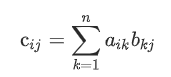

m4_include(../../../setup.m4)

# Lecture 16 - tensor flow - math 

What is A "tensor" and how will it "flow"?

In the general definition "tensors" are arrays of numbers organized into an n-dimensional grid.

A scalar is a 1-ish number.  This is the simplest kind of tensor:


```
m4_include(tf1.py.nu)
```

Elements are positionaly identifiable.  So A at i,j,k is `Ai,j,k`.

A vector is a 1x array of numbers.  `[1,2,4]`  that is the x,y,z distance from the origin.

The tensor is the 3d vector of each of these.

You are not limited to 3d data.

<div class="pagebreak"></div>

So...

Tensor:


Ranking:

rank 0 - scalar

rank 1 - vector [1,2,3]

rank 2 - matrix [ [1,2] , [2, 3] ]

rank 3 - 3 tensor

rank 4 - 4 tensor

Add of 2 matrix tensors

add1.py:

```
m4_include(add1.py.nu)
m4_comment([[[
import tensorflow as tf

# let's create a ones 3x3 rank 2 tensor
rank_2_tensor_A = tf.ones([3, 3], name='MatrixA')
print("3x3 Rank 2 Tensor A: \n{}\n".format(rank_2_tensor_A))

# let's manually create a 3x3 rank two tensor and specify the data type as float
rank_2_tensor_B = tf.constant([[1, 2, 3], [4, 5, 6], [7, 8, 9]], name='MatrixB', dtype=tf.float32)
print("3x3 Rank 2 Tensor B: \n{}\n".format(rank_2_tensor_B))

# addition of the two tensors
rank_2_tensor_C = tf.add(rank_2_tensor_A, rank_2_tensor_B, name='MatrixC')
print("Rank 2 Tensor C with shape={} and elements: \n{}".format(rank_2_tensor_C.shape, rank_2_tensor_C))
]]])
```

<div class="pagebreak"></div>

Some matrix multiplication: 

Definition of multiply




Let's multiply using TF:

File matmul1.py:

```
m4_include(matmul1.py.nu)
```

output matmul1.out:

```
m4_include(matmul1.out)
```

Compare to a matrix multiply directly in code.

File matmul3.py:

```
m4_include(matmul3.py.nu)
m4_comment([[[
# Example of multipying 2 matricies in Python

# 3x3 matrix
X = [[12,7,3],
     [4 ,5,6],
     [7 ,8,9]]
# 3x4 matrix
Y = [[5,8,1,2],
     [6,7,3,0]]
# result is 3x4
result = [[0,0,0,0],
          [0,0,0,0],
          [0,0,0,0]]

# iterate through rows of X
for i in range(len(X)):
   # iterate through columns of Y
   for j in range(len(Y[0])):
       # iterate through rows of Y
       for k in range(len(Y)):
           result[i][j] += X[i][k] * Y[k][j]

a = "["
com = ","
for i in range(len(result)):
   if i+1 == len(result):
       com = "]"
   print("{}{}{}".format(a,result[i],com))
   a = " "
]]])
```

output:

```
m4_include(matmul3.out)
```


Inner Dimentions must be the same.

A by hand example:


With Some Data

First a 1x example:


## Matrices are useful

Calculate Inverse of a Matrix:

File: inv.py:

```
m4_include(inv.py.nu)
m4_comment([[[
import tensorflow as tf

iim_matrix_A = tf.constant([[2, 3], [2, 2]], name='MatrixA', dtype=tf.float32)

try:
    # Tensorflow function to take the inverse
    inverse_matrix_A = tf.linalg.inv(iim_matrix_A)

    # Creating a identity matrix using tf.eye
    identity_matrix = tf.eye(2, 2, dtype=tf.float32, name="identity")

    iim_RHS = identity_matrix
    iim_LHS = tf.matmul(inverse_matrix_A, iim_matrix_A, name="LHS")

    predictor = tf.reduce_all(tf.equal(iim_RHS, iim_LHS))
    def true_print(): print("""A^-1 times A equals the Identity Matrix
Matrix A: \n{0} \n\nInverse of Matrix A: \n{1} \n\nRHS: I: \n{2} \n
LHS: A^(-1) A: \n{3}""".format(iim_matrix_A, inverse_matrix_A,
    iim_RHS, iim_LHS))
    def false_print(): print("Condition Failed")
    tf.cond(predictor, true_print, false_print)

except:
    print("""A^-1 doesnt exist
    Matrix A: \n{} \n\nInverse of Matrix A: \n{} \n\nRHS: I: \n{}
    \nLHS: (A^(-1) A): \n{}""".format(iim_matrix_A, inverse_matrix_A, iim_RHS, iim_LHS))
]]])
```

And the output:

```
m4_include(inv.out)
```


