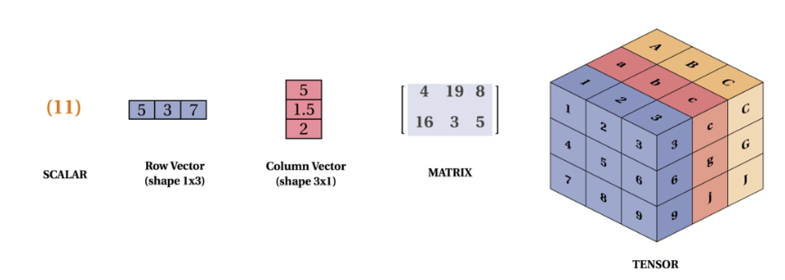
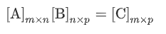
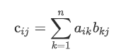
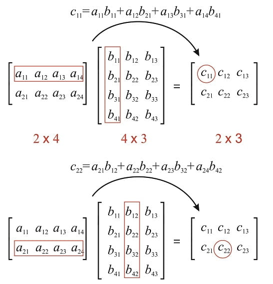
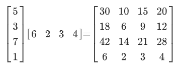

m4_include(../../../setup.m4)

# Lecture 18 - tensor flow - math 

What is A "tensor" and how will it "flow"?

In the general definition "tensors" are arrays of numbers organized into an n-dimensional grid.

A scalar is a 1-ish number.  This is the simplest kind of tensor:


```
m4_include(tf1.py)
```

Elements are positionaly identifiable.  So A at i,j,k is `Ai,j,k`.

A vector is a 1x array of numbers.  `[1,2,4]`  that is the x,y,z distance from the origin.

The tensor is the 3d vector of each of these.

You are not limited to 3d data.


So...

Tensor:




Ranking:

rank 0 - scalar

rank 1 - vector [1,2,3]

rank 2 - matrix [ [1,2] , [2, 3] ]

rank 3 - 3 tensor

rank 4 - 4 tensor

Add of 2 matrix tensors

add1.py:

```
m4_include(add1.py)
```


Some matrix multiplication: 

Definition of multiply




Let's multiply using TF:

matmul1.py:
```
m4_include(matmul1.py.nu)
```

output matmul1.out:

```
m4_include(matmul1.out)
```

Inner Dimentions must be the same.

A by hand example:



With Some Data

First a 1x example:




## Matrices are useful


Calculate Inverse of a Matrix:

inv.py:

```
m4_include(inv.py.nu)
```

And the output:

```
m4_include(inv.out)
```


