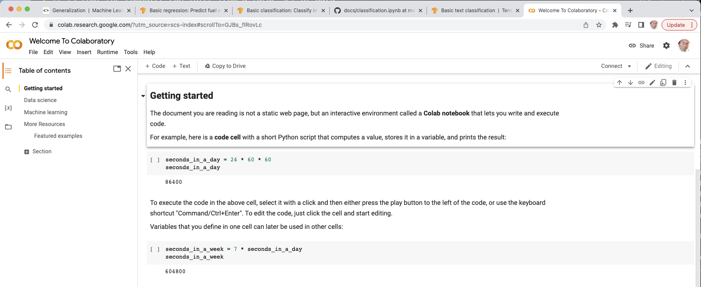

<style>
.pagebreak { page-break-before: always; }
.half { height: 200px; }
</style>
<style>
.pagebreak { page-break-before: always; }
.half { height: 200px; }
.markdown-body {
	font-size: 12px;
}
.markdown-body td {
	font-size: 12px;
}
</style>


# Lecture 17 - Video Lecture - TensorFlow Intro

On YouTube:

1010-S22-Lect-pt1-why-ml.mp4
[https://youtu.be/nfard0_o5Mk](https://youtu.be/nfard0_o5Mk)

1010-S22-pt2-colab-quick-intro.mp4
[https://youtu.be/sOk6nu_8-24](https://youtu.be/sOk6nu_8-24)

1010-S22-pt3-colab-code-walkthrough.mp4
[https://youtu.be/ijlnf1KQRjw](https://youtu.be/ijlnf1KQRjw)

1010-S22-pt4-vscode-code-walkthrough.mp4
[https://youtu.be/EG7zHJdMM0w](https://youtu.be/EG7zHJdMM0w)


What is important about machine learning. 
It is that the computer can infer from a large set of data
results on new data that it has never seen before.

## TensorFlow HelloWorld

Start with a Hello World that should print out 
the version of tensor flow.

```
  1: # TensorFlow and tf.keras
  2: import tensorflow as tf
  3: 
  4: # Helper libraries
  5: import numpy as np
  6: import matplotlib.pyplot as plt
  7: 
  8: print("TensorFlow Hello World")
  9: print(tf.__version__)

```

## TensorFlow on codlab - google online system.

If you are using google colab, then [https://colab.research.google.com/?utm_source=scs-index](https://colab.research.google.com/?utm_source=scs-index)



Change the first block.

Click the little arrow to run it.

Register to use colab.

## Machine Learning - what is it

Machine learning is a system where the machine can infer the results when you have data that is new based on old data.


