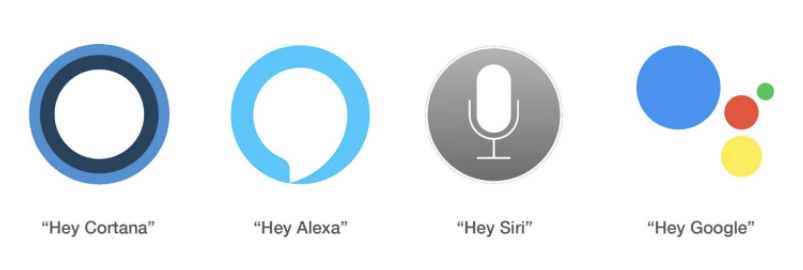
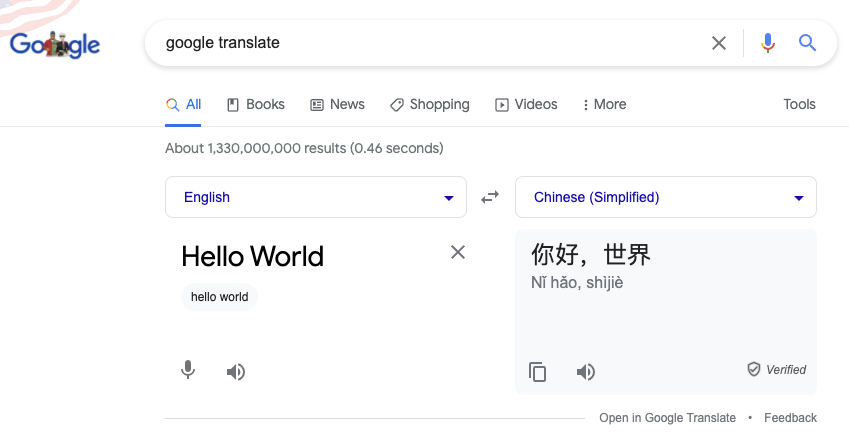
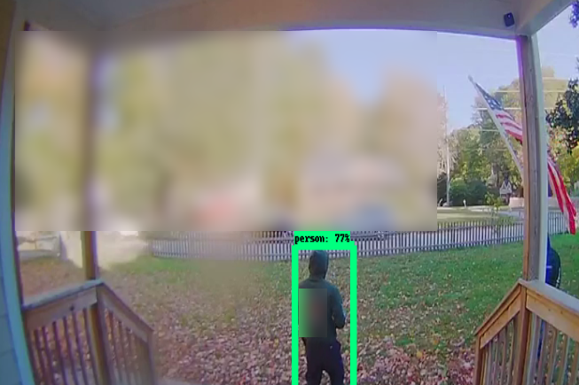

# Lecture 18 - Machine Learning Use Cases

We talked about some stuff that ML fails to do well.  Real-Estate, Forecasting stock prices etc.

Now let's talk about ML use cases that work.   Not stuff that is in the future... but today.

## Voice Assistant - Voice Recognition

Voice assistants are all over:

Voice assistants are ubiquitous. Popular ones include:

- Apple’s Siri
- Google Assistant
- Google Duplex
- Amazon’s Alexa
- Samsung’s Bixby
- Microsoft’s Cortana

Also voice activated menus.  They are super irritating, but they will get better.
My wife seems to have a tone/voice that just will not operate them.

An example of Backward Thinking:

From : https://www.gao.gov/assets/gao-19-257.pdf:

<dd>
	_"software that uses a training dataset to “learn” how to read information
	from a form filled out by a person;"_
</dd>

The question is why are we filling out forms on paper at all?  

What about combining them.  Filling out online forms - especially .PDFs is really irritating on
a phone.  What about using a voice assistant to fill out forms and keep the data digital.

[https://www.tensorflow.org/tutorials/audio/simple_audio](https://www.tensorflow.org/tutorials/audio/simple_audio)

Last semester I trained this exact code to analyze my audio for pre-recorded class lectures - to find
the "ums" and "ahs" and "cough" and long silent patches.    Then I had a time-index in video to know
where to go and edit out bad sections.

Another really good web article on voice recognition:

[https://www.analyticsvidhya.com/blog/2019/07/learn-build-first-speech-to-text-model-python/](https://www.analyticsvidhya.com/blog/2019/07/learn-build-first-speech-to-text-model-python/)

## Language Translation - Google Translate

For people learning languages and for us computer people that just want
to test with unicode characters - this is awesome!

There are live translation systems - that will listen and translate
on the fly - they work sort of.  There are systems that you can
talk into and translate to a different language.  Most of them
are working on speech-recognition combined with the google-translate
API.

## Taking Better Pictures - Focus

Facial recognition - focus on peoples faces is one part of this.   This is not the creepy identification of
of individuals - this is just pick out the faces in the image.

[https://towardsdatascience.com/building-face-recognition-model-under-30-minutes-2d1b0ef72fda](https://towardsdatascience.com/building-face-recognition-model-under-30-minutes-2d1b0ef72fda)

Depth separation is a 2nd part of this - if you know what is at what depth in the image then you can focus on the "subject" of the picture.

[https://www.analyticsvidhya.com/blog/2019/02/tutorial-semantic-segmentation-google-deeplab/](https://www.analyticsvidhya.com/blog/2019/02/tutorial-semantic-segmentation-google-deeplab/)

Identification of the "subject" in a picture is another kind of machine learning.

[https://www.tensorflow.org/lite/examples/object_detection/overview](https://www.tensorflow.org/lite/examples/object_detection/overview)

## Image processing - Better Pictures

Zoom has this now - working on live video.  My screen recorder allows this.  Kind of slow but it works.
Adobe Premiere Pro - has it.  You can just tell it to blur the background in images and video.

## Security Systems

Lots of stuff with security systems.   You may want to detect when an unexpected person is
on the parch.  This is a "detect" intruder system:

The article on this:

[https://towardsdatascience.com/tensorflow-on-edge-or-building-a-smart-security-camera-with-a-raspberry-pi-5bb2fc039b0f](https://towardsdatascience.com/tensorflow-on-edge-or-building-a-smart-security-camera-with-a-raspberry-pi-5bb2fc039b0f)

Or when the dog is walking around in your house and not set off the alarm.

The Github for an example animal detector:

[https://github.com/gaiar/animal-detector/tree/dev](https://github.com/gaiar/animal-detector/tree/dev)

and a "medium" paywalled article on it:

[https://towardsdatascience.com/detecting-animals-in-the-backyard-practical-application-of-deep-learning-c030d3263ba8](https://towardsdatascience.com/detecting-animals-in-the-backyard-practical-application-of-deep-learning-c030d3263ba8)

## Generation of Fake Faces

It used to be true that if you had an image of a person that you probably had
a real live perosn:  How about this:

This is not a real person.  You can buy images like this by the thousands!
And the source code is available on github.com!

## Maps and Routing - Uber / Google-Maps / Apple-Maps / Waymo-Self driving - routing.

Lots of stuff is based on using ML to optimize transportation.

Routing is one.  Google maps.

Dynamic pricing - uber, lyft etc.

## Deep Fakes

Fake of Obama.

Detection of Deep Fakes.

[deepfake-detect.com site](deepfake-detect.com.png)

And the source:

[https://github.com/aaronchong888/DeepFake-Detect](https://github.com/aaronchong888/DeepFake-Detect)

## Credits

Some images in this are taken from the linked articles and have been used with permission of the author.

