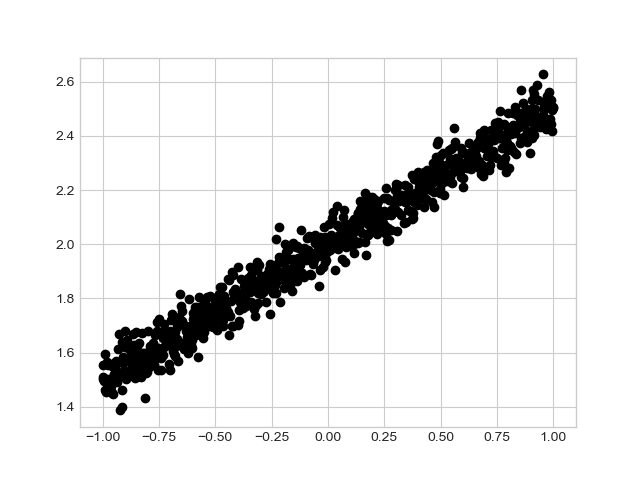

m4_include(../../../setup.m4)

# Lecture 25 - Machine Learning Models


## Two types of machine learning

### Supervised

An example is Email spam filtering.

Start with some labeled data that has some "features"

```
	< Features, Lable >
```

A set of email that is or is not spam.  Probably start with a sizable set.

You train the "Model" to classify based on the existing set.

Then...

You give it new data that the model has never seen and let it identify
if it is or is not spam.

```
	< Features, ?? >
```

The Model is then used to generate the Label.

Key terms : Features, Labels, Model

Key Idea - you don't need to know what the "features" are.

Key Idea - you don't need to write the "program" that performs the classification.

This is much more of a "science" than traditional programming.

### Non-Supervised 

This requires a constant evaluation function.  How do you know when you are more successful.

We will get back to this.


## How a "machine" learns

Example of square feet v.s. price of a house

Price     |  Value
----------|-----------
$120 | good
$136 | maybe
$142 | too much
$110 | something is wrong


What is "Loss" - L-Squred, Minimization of Loss

Linear regression

Key Terms: Linear Regression, L-Squared, Minimization of Loss


## Linear Model Example - Gradient Decent

Gradient Decent - this has a "tunable" learning rate parameter.

Gradient Decent combines a direction and a scale for each move.  This is
multiplied by the *learning rate*.

Given a gradient of 5.5 and a learning rate of 0.02 the algorithm will pick
the next point as `5.5*0.02` or .11 away from the current point.

This is a "goldylox" type solution.

Example of Little Moves

Example of Too Big


Example of Too Small


Example of Just Right


Nothing says that you get the "right" solution either.

Example - Interactive 3d.

[https://blog.skz.dev/gradient-descent](https://blog.skz.dev/gradient-descent)


There is math in this - The ideal learning rate in 2D is 1/(f(x))'' - 2nd derivative
of the function.   In more dimensions it is the second partial derivative.   The problem
is the number of variables.   Google base search has 400,000 variables - so that is 400k
dimensions.  The practical answer is to use some guess work based on "field knowledge"
and run a set of tests.

This runs into the problem - if I have 10,000,000 input images and I guess it takes
forever to train.  There is good reason to believe that you can guess/train to figure
out the "learning rate" on 10 to 1000 for a data size and then use this on the full
set of data.

## Over fitting

In the real world.

[https://danluu.com/car-safety/](https://danluu.com/car-safety/)


## Learn Based on a Linear Model

```
m4_include(tf8-linear-model.py.nu)
```

<div class="pagebreak"></div>

## A runner that lets us predict

```
m4_include(tf9.py.nu)
```




