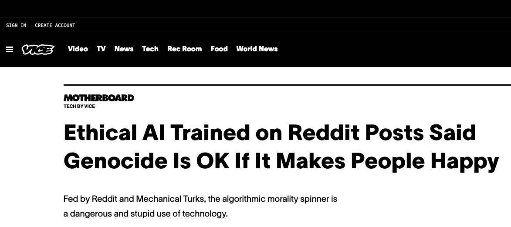
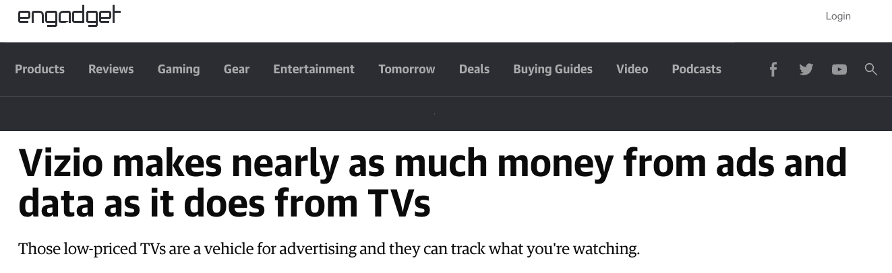

# Lecture 20 - Features / Overhitting etc.

# Ethics

[https://www.vice.com/en/article/v7dg8m/ethical-ai-trained-on-reddit-posts-said-genocide-is-okay-if-it-makes-people-happy](https://www.vice.com/en/article/v7dg8m/ethical-ai-trained-on-reddit-posts-said-genocide-is-okay-if-it-makes-people-happy)

Please go and watch:

[https://www.youtube.com/watch?v=2ZiPEOFnK1o](https://www.youtube.com/watch?v=2ZiPEOFnK1o)

A talk by Janelle Shane | You Look Like a Thing and I Love You | Talks at Google

## Privacy and Surveillance

Do you have a rite to secrecy?

Humans are "leaking" data to our devices all the time.   Location data, for example, is 
incredibly powerful.

1. Location data that shows that a person has a particular behavior.
In this case I am thinking of a Catholic Bishop that was outed for is
sexual orientation using location data.
2. Location data used by "stalkers" to track victims.

Apps that you install can get this data.   Sometimes intentionally.  Sometimes by function.
A iPhone "flashlight" that tracks your location.  Or an employer tracking device that
determines where you are when you are at work - but also sells the data of where you
are when all the time.

Financial data.

1. Payment transfer data that is used to show that a spouse is cheating.
2. Payment data that shows that a person is at a location at a certain time.

App Data - what apps you use.

Battery data - what is the level of charge of your phone.

Cameras watching you.  Facial recognition.  Gate and pace recognition.

"The data trail we leave behind is how our “free” services are paid
for—but we are not told about that data collection and the value
of this new raw material, and we are manipulated into leaving ever
more such data. For the “big 5” companies (Amazon, Google/Alphabet,
Microsoft, Apple, Facebook), the main data-collection part of their
business appears to be based on deception, exploiting human weaknesses,
furthering procrastination, generating addiction, and manipulation
(Harris 2016 [OIR]). The primary focus of social media, gaming, and
most of the Internet in this “surveillance economy” is to gain,
maintain, and direct attention—and thus data supply. “Surveillance
is the business model of the Internet” (Schneier 2015). This
surveillance and attention economy is sometimes called “surveillance
capitalism” (Zuboff 2019)."

[https://plato.stanford.edu/entries/ethics-ai/](https://plato.stanford.edu/entries/ethics-ai/)
(Read for Final!)

All of us has a "narrative" that we want to tell other people that is not really our life.
How much of your real "life" do you want to have revealed.

1. Credit scores are used to determine what you can rent (apartments, cars, etc) what jobs you get.
2. Social media data collection can determine vast information about you...  A picture of you at a
party will often contain GPS location data in the image, and identify your behavior.  An car insurance
company can use social media data to determine your risk of being a drunk driver based on images
of you.  For example - a ML that looks for Red Solo Cups at a party is a predictor of drunken
behavior.

## Derived data 

Derived data - and thereby derived ability to manipulate - is the real thereat.

[https://www.engadget.com/vizio-q1-earnings-inscape-013937337.html](https://www.engadget.com/vizio-q1-earnings-inscape-013937337.html)
(skim for final)

These systems combined with machine learning know more about us than we know about ourselves.

##  Manipulation of Behavior

Design of systems has become heavily influenced by the ability to produce "addition" to the interface.
The designer of the Facebook Interface has a book called, "Hooked: How to Build Habit-Forming Products".

Manipulation of the user - so as to maximize profit - or maximize attention has become a core business
model for a large portion of the Internet. 

For example....  It has been really clearly shown that to be productive in working on some task you
need chunks of un-interrupted time.  Having a "bell" that rings, or a pop-up message on your phone
generally grantees that you will be interrupted.  So let's create a bunch of different 
communication tools, Email, Slack, Discord, and expect that the people that we work with 
respond to all of them all the time.  

Social media is the primary source of political propaganda.  This influence can be used to alter users
voting habits.  Validation of what users see based on what is "true" or accurate is non-existent.
The only validation that is performed is a ML determining what is likely to get the most attention
and generate the most advertising revenue.

## Opacity of AI/ML systems.

Somebody asked if we can determine how the ML reached it's conclusion.   That is serious concern.
EU data privacy laws have been changed to make this a requirement but ... and this is a big but ...
how do you actually determine this.  Also ML systems that learn on an ongoing basis - what it
will do on one day is not the same as on another day.

If an AI/ML system is determining important things about our future - making assessments of "risk"
or assessments of "value" - then do we have a right to know how/what it is assessing.

Henry Kissinger, former Secretary of State,  has just written a book - 98 years old and still 
working on stuff - that points out the fundamental problem for democratic decision-making - if
we rely on a system that can and will influence our attitudes - do we have a right to have an
explanation of what that system is doing.  Do we need get explanations of its decisions.

### Decisions Support Systems

1. The Halo effect - if you use a support system you often can not change or influence the outcome.
2. Laziness - why not just accept what the support system provides.

### Automation Distrust Bias

1. How can a "system" produce better results than a person.
2. Training is only as good as the data.  Was the data any good?

## Bias

Systems are trained on data from the past.  So if in the past there was a "bias" in the
system then the new automated system will have that.  Amazon used a ML system to filter for
hiring - only to discover that the system discriminated again women.  They pulled the automated
system.  But think about this - if the system was trained on the prior practices of hiring then
Amazon already had discrimination again women.  The system was revealing about the data that
it was trained on.

## Generalization is what we want

When we fit a model we want it to generalized to new data.   Often this is not what we get.
This is usually due to "overhitting".

By trying to minimize "loss" in a model we end up with a model that only describes the
set of training data and has no predictive value.

This is especially true when we don't know what the "features" are and we are relying on
a deep network to identify the features - Images are an example of this.

Good / Bad of Computer Science - Working outside of your field.

Statistical errors, like overhitting are, not limited to Machine Learning: [https://www.theatlantic.com/magazine/archive/2010/11/lies-damned-lies-and-medical-science/308269/](https://www.theatlantic.com/magazine/archive/2010/11/lies-damned-lies-and-medical-science/308269/)

Goal: The goal of Machine Learning is to use a sample of data and to generate a set of predictive functions for new
data.  This estimate of the "probability" distribution requires a bunch of "assumptions" (explain).  Also the model
can't see the "real" or "whole" truth.  All the model gets is a "sample".   When the model has a good "fit" to
the data what assurances do you have that the model has "predictive" power on new never-before-seen data.

1. That the data is stable over time.
2. That you don't goof with what constitutes the training set and the testing set.
3. That there is a relationship that can be derived from this set - I.E. the set is large enough to reveal what you are looking for.
4. That the training set is representative of what you want to train on.

So when you sample a set of data it has to be an *independent and identical sample* - Examples can not influence each other.

The distribution of data can not change with the set.

You have to draw your sub-sets of training / validation data from the same set.

So... We violate this all the time.

Think about using ML for driving a car.  As soon as you add map-data and you say that the ML
will only need to user knowledge of where the car is - what path it is following / or planning
to follow - you have violated this set of "statistical" rules for validity.

## Training Set / Test Set / Validation Set

If you run your test multiple times you are "faking" the results.

So suppose we split into 3 sets.  A training set, A test set and a reserve set that we will
use for validation of the model after the training is complete.

## Bad Fit

## Good Fit

