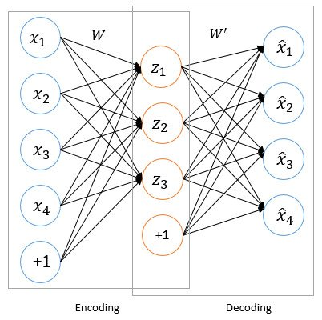

<style>
.pagebreak { page-break-before: always; }
.half { height: 200px; }
</style>
<style>
.pagebreak { page-break-before: always; }
.half { height: 200px; }
.markdown-body {
	font-size: 12px;
}
.markdown-body td {
	font-size: 12px;
}
</style>


# Lecture 21 - Text Classification Example

## This Weeks Lab

Take the text classification example and use it.

## Text Classification Uses

1. Sentiment Analysis on Product Reviews
2. Classification of Email as SPAM
3. Classification of Medical Data - Prediction of Symptoms to Disease
4. Social Media Text Classification


## How CNN works - Convectional Neural Networks

### Text is split into chunks  

The input may be split into areas as in an image - but this is a text example.
So think of Paris of words, word triplets etc.

This is referedd to as "pooling" - with an image you may have averages -
with text it is just proximate grouping.


Text looks like this


### network is built out of layers that recognize chunks




## Text Classification Example

```
  1: # ----------------------------------------------------------------------------
  2: # Setup
  3: # ----------------------------------------------------------------------------
  4: import matplotlib.pyplot as plt
  5: import os
  6: import re
  7: import shutil
  8: import string
  9: import tensorflow as tf
 10: 
 11: from tensorflow.keras import layers
 12: from tensorflow.keras import losses
 13: 
 14: print(tf.__version__)
 15: 
 16: 
 17: # ----------------------------------------------------------------------------
 18: # Get data.
 19: # ----------------------------------------------------------------------------
 20: 
 21: # Location to pull data from
 22: 
 23: url = "https://ai.stanford.edu/~amaas/data/sentiment/aclImdb_v1.tar.gz"
 24: 
 25: dataset = tf.keras.utils.get_file("aclImdb_v1",
 26:     url,
 27:     untar=True, cache_dir='.',
 28:     cache_subdir='')
 29: 
 30: dataset_dir = os.path.join(os.path.dirname(dataset), 'aclImdb')
 31: print ( os.listdir(dataset_dir) )
 32: 
 33: 
 34: 
 35: train_dir = os.path.join(dataset_dir, 'train')
 36: print ( os.listdir(train_dir) )
 37: 
 38: 
 39: sample_file = os.path.join(train_dir, 'pos/1181_9.txt')
 40: with open(sample_file) as f:
 41:     print(f.read())
 42: 
 43: 
 44: # Discard data we are not using.
 45: remove_dir = os.path.join(train_dir, 'unsup')
 46: shutil.rmtree(remove_dir)
 47: 
 48: 
 49: # ----------------------------------------------------------------------------
 50: # xyzzy
 51: # ----------------------------------------------------------------------------
 52: 
 53: batch_size = 32
 54: seed = 42
 55: 
 56: raw_train_ds = tf.keras.utils.text_dataset_from_directory(
 57:     'aclImdb/train',
 58:     batch_size=batch_size,
 59:     validation_split=0.2,
 60:     subset='training',
 61:     seed=seed)
 62: 
 63: for text_batch, label_batch in raw_train_ds.take(1):
 64:     for i in range(3):
 65:         print("Review", text_batch.numpy()[i])
 66:         print("Label", label_batch.numpy()[i])
 67: 
 68: print("Label 0 corresponds to", raw_train_ds.class_names[0])
 69: print("Label 1 corresponds to", raw_train_ds.class_names[1])
 70: 
 71: 
 72: 
 73: # ----------------------------------------------------------------------------
 74: # xyzzy
 75: # ----------------------------------------------------------------------------
 76: 
 77: raw_val_ds = tf.keras.utils.text_dataset_from_directory(
 78:     'aclImdb/train',
 79:     batch_size=batch_size,
 80:     validation_split=0.2,
 81:     subset='validation',
 82:     seed=seed)
 83: 
 84: raw_test_ds = tf.keras.utils.text_dataset_from_directory(
 85:     'aclImdb/test',
 86:     batch_size=batch_size)
 87: 
 88: 
 89: def custom_standardization(input_data):
 90:     lowercase = tf.strings.lower(input_data)
 91:     stripped_html = tf.strings.regex_replace(lowercase, '<br />', ' ')
 92:     return tf.strings.regex_replace(stripped_html, '[%s]' % re.escape(string.punctuation), '')
 93: 
 94: 
 95: # ----------------------------------------------------------------------------
 96: # pooling of data
 97: # ----------------------------------------------------------------------------
 98: 
 99: max_features = 10000
100: sequence_length = 250
101: 
102: vectorize_layer = layers.TextVectorization(
103:     standardize=custom_standardization,
104:     max_tokens=max_features,
105:     output_mode='int',
106:     output_sequence_length=sequence_length)
107: 
108: # Make a text-only dataset (without labels), then call adapt
109: train_text = raw_train_ds.map(lambda x, y: x)
110: vectorize_layer.adapt(train_text)
111: 
112: 
113: 
114: def vectorize_text(text, label):
115:     text = tf.expand_dims(text, -1)
116:     return vectorize_layer(text), label
117: 
118: 
119: # retrieve a batch (of 32 reviews and labels) from the dataset
120: text_batch, label_batch = next(iter(raw_train_ds))
121: first_review, first_label = text_batch[0], label_batch[0]
122: print("Review", first_review)
123: print("Label", raw_train_ds.class_names[first_label])
124: print("Vectorized review", vectorize_text(first_review, first_label))
125: 
126: 
127: print("1287 ---> ",vectorize_layer.get_vocabulary()[1287])
128: print(" 313 ---> ",vectorize_layer.get_vocabulary()[313])
129: print('Vocabulary size: {}'.format(len(vectorize_layer.get_vocabulary())))
130: 
131: 
132: 
133: # ----------------------------------------------------------------------------
134: # Setup Training / Testing Data
135: # ----------------------------------------------------------------------------
136: 
137: 
138: train_ds = raw_train_ds.map(vectorize_text)
139: val_ds = raw_val_ds.map(vectorize_text)
140: test_ds = raw_test_ds.map(vectorize_text)
141: 
142: 
143: 
144: AUTOTUNE = tf.data.AUTOTUNE
145: 
146: train_ds = train_ds.cache().prefetch(buffer_size=AUTOTUNE)
147: val_ds = val_ds.cache().prefetch(buffer_size=AUTOTUNE)
148: test_ds = test_ds.cache().prefetch(buffer_size=AUTOTUNE)
149: 
150: 
151: embedding_dim = 16
152: 
153: 
154: # ----------------------------------------------------------------------------
155: # Multi Layer Model
156: # ----------------------------------------------------------------------------
157: 
158: model = tf.keras.Sequential([
159:     layers.Embedding(max_features + 1, embedding_dim),
160:     layers.Dropout(0.2),
161:     layers.GlobalAveragePooling1D(),
162:     layers.Dropout(0.2),
163:     layers.Dense(1)])
164: 
165: model.summary()
166: 
167: 
168: model.compile(loss=losses.BinaryCrossentropy(from_logits=True),
169:               optimizer='adam',
170:               metrics=tf.metrics.BinaryAccuracy(threshold=0.0))
171: 
172: 
173: 
174: 
175: # ----------------------------------------------------------------------------
176: # Train Model
177: # ----------------------------------------------------------------------------
178: 
179: epochs = 10
180: history = model.fit(
181:     train_ds,
182:     validation_data=val_ds,
183:     epochs=epochs)
184: 
185: 
186: 
187: # ----------------------------------------------------------------------------
188: # Evaluate Model
189: # ----------------------------------------------------------------------------
190: 
191: loss, accuracy = model.evaluate(test_ds)
192: 
193: print("Loss: ", loss)
194: print("Accuracy: ", accuracy)
195: 
196: 
197: history_dict = history.history
198: history_dict.keys()
199: 
200: 
201: 
202: # Review results of Training
203: 
204: 
205: acc = history_dict['binary_accuracy']
206: val_acc = history_dict['val_binary_accuracy']
207: loss = history_dict['loss']
208: val_loss = history_dict['val_loss']
209: 
210: epochs = range(1, len(acc) + 1)
211: 
212: # "bo" is for "blue dot"
213: plt.plot(epochs, loss, 'bo', label='Training loss')
214: # b is for "solid blue line"
215: plt.plot(epochs, val_loss, 'b', label='Validation loss')
216: plt.title('Training and validation loss')
217: plt.xlabel('Epochs')
218: plt.ylabel('Loss')
219: plt.legend()
220: 
221: plt.show()
222: 
223: 
224: 
225: 
226: 
227: plt.plot(epochs, acc, 'bo', label='Training acc')
228: plt.plot(epochs, val_acc, 'b', label='Validation acc')
229: plt.title('Training and validation accuracy')
230: plt.xlabel('Epochs')
231: plt.ylabel('Accuracy')
232: plt.legend(loc='lower right')
233: 
234: plt.show()
235: 
236: 
237: # ----------------------------------------------------------------------------
238: # Export Model so we can use it.
239: # ----------------------------------------------------------------------------
240: 
241: export_model = tf.keras.Sequential([
242:     vectorize_layer,
243:     model,
244:     layers.Activation('sigmoid')
245: ])
246: 
247: export_model.compile(
248:     loss=losses.BinaryCrossentropy(from_logits=False), optimizer="adam", metrics=['accuracy']
249: )
250: 
251: # Test it with `raw_test_ds`, which yields raw strings
252: loss, accuracy = export_model.evaluate(raw_test_ds)
253: print(accuracy)
254: 
255: 
256: 
257: 
258: # ----------------------------------------------------------------------------
259: # Test with new data.
260: # ----------------------------------------------------------------------------
261: 
262: examples = [
263:     "The movie was great!",
264:     "The movie was okay.",
265:     "The movie was terrible...",
266:     "The best time ever",
267:     "Horrid waste of time"
268: ]
269: 
270: print ( export_model.predict(examples) )

```

