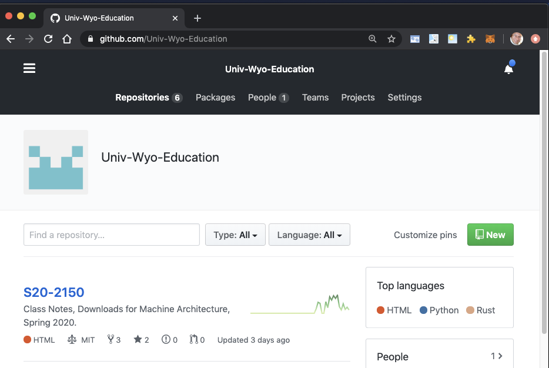

m4_include(../../../setup.m4)

# Lecture 29 - Git - a very important software tool

## What is Version Control?

git is a source code control system.  This means that it keeps copies of files that you
can use in a project.  When you make a change it keeps the differences between the changes.
This means that you can go back in time and get the old version of files back.
 
git also has the concept of branches.  A branch is a named set of changes.  Let's say that
you have a product that your produce and it is version `v1.0.0`.  Then you make a change to
fix a customer problem on branch `customer-patch0001`.  So you send this version out to the
customer - but now you want to add this to your main set of code - `v1.0.0` - also since
this fix you development team has built a new version of the code - but the features that
they have added are in a different set of the code.  So the current version of the code
is now `v1.1.0` - and you need to have both the original code with the patch for your
other customers ( `v1.0.1` - patch applied ) and the new set of code with the patch - as
version `v1.1.1` and distribute the modified versions of both.

Also you need to track who made changes to the code.  This can be a legal requirement
if the code is HIPPA based - where verifying that only the correct set of developers
made changes.  (There are 14 different laws in the US that apply to this now).
So one of the "features" that "git" provides is digital signatures that prove that
the correct developer is making changes to code.

Another item that git provides is the ability to add "descriptions" or comments
to code as to why it changes.  Our branch with `customer-patch0001` probably needs
some comments associated with it - like which customer it was for, what the test
are that had to be written and passed - when it was done - who tested it
where it is documented etc... 

Git is relatively unique in that you can do all of this across a distributed environment
where each person has a copy of the data and it allows a team to work together.  People have
built big businesses on top of "git" and provide additional development services.  Github.com (now unwed
by Microsoft) and gitlab.com are examples.  You can also run your own private "git" repository
and not subscribe to any of the services.  I use all 3.   github.com, gitlab.com, gitlab's software
at UW in a private system, and a "git" repository on my own server.

There are GUI tools for using git if you just have to - but git was designed from the beginning
to be a command line tool.  There are 2 GUI things that I regularly use in relation to GIT -
1. Multi file compare
2. Branching tools
The rest of the time I use it from the command line (I also use the on-line github.com/gitlab.com merge facility) 
and the github.com code review capability.

So... Without further adieu....

To create your own git repository - you don't need anybody else - you need a copy of git installed.

Install Info: [https://git-scm.com/book/en/v2/Getting-Started-Installing-Git](https://git-scm.com/book/en/v2/Getting-Started-Installing-Git)

Install for Windows: [https://git-scm.com/download/win](https://git-scm.com/download/win)

Install for Mac - May already be installed: [https://www.atlassian.com/git/tutorials/install-git](https://www.atlassian.com/git/tutorials/install-git)

Now that you have it let's create a "project" called "sample-01"

```
$ mkdir sample-01
$ cd sample-01
$ git init .
```

You have created an empty git repository on your local system.  This is not shared with anybody.
This is useful all on it's own.  First what happens when you edit an delete that chunk of code you
really need.  Or you try something and it fails and you want to go back to a previous version.
If you have regularly been keeping track of your changes in git, then no big deal.  Just go back.
All on it's own it makes an fantastic "backup" for source code.

Let's put our first fail into git.  Edit a file called `README.md` and put some text in it.
Let's say you insert "this is my 1st git!" on a line.  Then exit and save the file.

```
$ vi README.md
```

Now let's add it.

```
$ git add README.md
```

This will stage the file for the repository.  If you change the file before "commit"-ing then you 
will need to add it again.  If you make a mistake and add the wrong file there is a way to un-add 
files (sears google for "git reset")

Now lets add this file!

```
$ git commit -m "My First File" -m "This is just a test file" 
```

The first `-m` is the title for the comment, then 2nd `-m` is the comment.   If you commit win tout
a `-m` at all and you have a properly configured editor it will bring up your editor to create
the comment.

We can now use "git log" to find out what has been committed and what the comments are.

```
$ git log
```

We have been making direct changes to the "master" branch.  This is a special branch that has
the main set of code on it.   You can see what branch you are on with "git branch".

```
$ git branch
```

You should see in green the world "master" with a "*" in front of it.

Most projects will not let you directly change the master - you have to create a branch,
make and test your changes, then propose your changes to the "owner" of the project as a
"pull request".   Let's take a look at how you work with a simple branch.

To create a branch you do:

```
$ git checkout -b my-first-branch
```

This will create a named branch "my-first-branch"

The "-b" created the branch.  You are now on the branch.

```
$ get branch
```

Should show you this.


Let's make a change, add a file, and commit it.

```
$ vi branch-file.txt
$ add branch-file.txt
$ git commit -m "on branch test"
```

Now do "git log"

```
$ git log
```

You should see something like:

```
commit 69b498b8321bc3802b30271d9a40faa25d1784d7 (HEAD -> my-first-branch)
Author: Philip Schlump <pschlump@gmail.com>
Date:   Thu Apr 23 13:22:51 2020 -0600

    on branch test

commit 3c0f2a531461922d36d5067adaf7114ce61492f4 (master)
Author: Philip Schlump <pschlump@gmail.com>
Date:   Thu Apr 23 13:17:16 2020 -0600
```

This shows that we have created and commited on a branch.  The numbers after the
"commit" word are the "hash" values for each of the commits.

Let's switch back and forth between the branches and see what happens.

```
$ ls 
$ git checkout master
$ ls
$ git checkout my-first-branch
$ ls
```

The 1st ls shows us both files.  Then we switch to "master" and the file "branch-file.txt" should
disappear - the file is only on the branch.  Then we switch back to the branch and the file should
reappear.  To merge we need to be on the "master" branch.  So let's switch.

```
$ git checkout master
```

Now we can add in any branch we have.

```
$ git merge my-first-branch
```

The branch is still there but the "master" has had the changes added to it.
If you want to get rid of the branch - so that it is no longer tracked you can delete it with:

```
$ git branch -d my-first-branch
```

This is what is called a "fast-forward" merge.  We took the old master and merged and moved it
forward to the current new master.

At the end you can go back and see that you only have the branch master with:

```
$ git branch
```

What happens with files that you don't track?
You can have un-tracked files in your directory.  Let's create one and see it.
This is also how you find files that are changed but not staged with "git add" for
your commit.

```
$ vi un-tracked
$ vi branch-file.txt
```

Make a change in branch file, create a new file  called "un-tracked".

Now let's ask git what files have changed with:

```
$ git status
```

You should see:

```
On branch master
Changes not staged for commit:
  (use "git add <file>..." to update what will be committed)
  (use "git checkout -- <file>..." to discard changes in working directory)

	modified:   branch-file.txt

Untracked files:
  (use "git add <file>..." to include in what will be committed)

	un-tracked

no changes added to commit (use "git add" and/or "git commit -a")
```

It even gives you a helpful hint on the last line.  

Let's add our 2 files and commit.

```
$ git add branch-file.txt
$ git commit -m "Update to branch-file.txt"
```

Now we have 2 files in our repository and 1 un-tracked file.

```
$ git status
```

Will show us this.

What if I want to rename a file?

```
$ git mv branch-file.txt main-file.txt
```

Sometimes we want to save changes - but not commit them - when we switch to a different branch.
We can do this with

```
$ git stash
```

It will save changed fails so that later we can get them back - but will allow us to switch branches.

Let's add un-tracked - then we can use it to show how to remove a file.

```
$ git add un-tracked
$ git commit -m "test file added"
```

And remove un-tracked

```
$ git rm un-tracked
$ git commit -m "get rid of a file as a demo"
```

The file is now gone.

Let's take our project and create a "public" version of it on "http://github.com" - this will require that
you have a github.com account - you can create one for free (this will also work with gitlab.com - I prefer
gitlab.com - but I use both).

Sign into github.com - it should look something like:



then click on the green button that says "New" on the upper left.


this will give you a page with instructions on how to send your code to github.


We want the middle set.

```
$ git remote add origin git@github.com:Univ-Wyo-Education/sample-01.git
$ git push -u origin master
```

You will need to reface "Univ-Wyo-Education" with your user name.  Also
depending on how you are logging into github the stuff after "origin" will
be different.

This should produce some output that looks similar to:

```
Enumerating objects: 13, done.
Counting objects: 100% (13/13), done.
Delta compression using up to 12 threads
Compressing objects: 100% (9/9), done.
Writing objects: 100% (13/13), 1.07 KiB | 548.00 KiB/s, done.
Total 13 (delta 2), reused 0 (delta 0)
remote: Resolving deltas: 100% (2/2), done.
To github.com:Univ-Wyo-Education/sample-01.git
 * [new branch]      master -> master
Branch 'master' set up to track remote branch 'master' from 'origin'.
```

The "[new branch]..." stuff indicates that it pushed your files to github.com.

If this is your first time working with a "public repository" then 
let's give a big shout - "Yea!".  You have created work and published it to
the world!

Let's modify a file, create a version tag and push that to github.com.

First let's modify the README.md and put some manful info in it.
Include your name - and that this is a sample to learn git.

```
$ vi README.md
$ git add README.md
$ git commit -m "Provide content in README.md"
$ git push origin master
```

Now let's create a version tag.

```
$ git tag v0.0.1
$ git push origin v0.0.1
```

You now have a "tagged"  version that is published with a readme!.

You can also create a branch and the push the branch.


## Git Command Overview

Looking through my history this is 98.1% of the git commands that I have used for the last 7 years.  
There are other git commands - like re-writing history - or setting up multiple named git origins.
You just don't use them very often.
These are the ones that will get you from beginner to using git as an "expert".  At to using a GUI - I have used a GUI 4 times in 7 years to do 3-way diffs (not in the 98.1%)
I use git every single day - after vim and command (cd/cat/head/tail/ls/mv/rm/bash/zsh etc) line it is the most used "tool" that I have.

### Basics
- git help <command>: get help for a git command
- git init: creates a new git repo, with data stored in the .git directory
- git add <filename>: adds files to staging area
- git commit: creates a new commit
- git status: tells you what’s going on

### Write good commit messages!
- git checkout <revision>: updates HEAD and current branch
- git log: shows a flattened log of history
- git log --all --graph --decorate: visualizes history as a DAG
- git diff <filename>: show differences since the last commit
- git diff <revision> <filename>: shows differences in a file between snapshots

### Branching and merging
- git branch: shows branches
- git checkout -b <name>: creates a branch and switches to it same as git branch <name>; git checkout <name>
- git merge <revision>: merges into current branch
- git mergetool: use a fancy tool to help resolve merge conflicts
- git rebase: rebase set of patches onto a new base

### Remotes
- git push <remote> <local branch>:<remote branch>: send objects to remote, and update remote reference
- git fetch: retrieve objects/references from a remote
- git pull: same as git fetch; git merge
- git clone: download repository from remote
- git remote: list remotes
- git remote add <name> <url>: add a remote
- git branch --set-upstream-to=<remote>/<remote branch>: set up correspondence between local and remote branch

### Undo
- git commit --amend: edit a commit’s contents/message
- git reset HEAD <file>: unstage a file
- git checkout -- <file>: discard changes


## Reference

1. [https://www.atlassian.com/git/tutorials/learn-git-with-bitbucket-cloud](https://www.atlassian.com/git/tutorials/learn-git-with-bitbucket-cloud)
1. [https://www.atlassian.com/git/tutorials/using-branches](https://www.atlassian.com/git/tutorials/using-branches)
1. [https://www.atlassian.com/git/tutorials/using-branches/git-checkout](https://www.atlassian.com/git/tutorials/using-branches/git-checkout)
1. [https://www.atlassian.com/git/tutorials/using-branches/git-merge](https://www.atlassian.com/git/tutorials/using-branches/git-merge)
