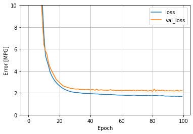

m4_include(./../../setup.m4)

# Assignment 12 - A deep learning predictive model.

Take the model in `predict-milage.py` and get it to run.

Try it with different numbers of intermediate layers ( line 142 to 145 ).
Add in 3 or 4 more layers and try it again.  Did this make any difference
in training.

The model is using `epochs=100` but when we look at graphs we see that 
there is very little training progress after a certain point.  
Change the number of epochs and reduce the amount of training time.
Try `epochs=50`.   This is in 3 places in the code.  ( line 163, 187 and line 94 ).

Loss Graph with 100 epochs:

Turn in your loss graph that shows that you can use less training cycles.

