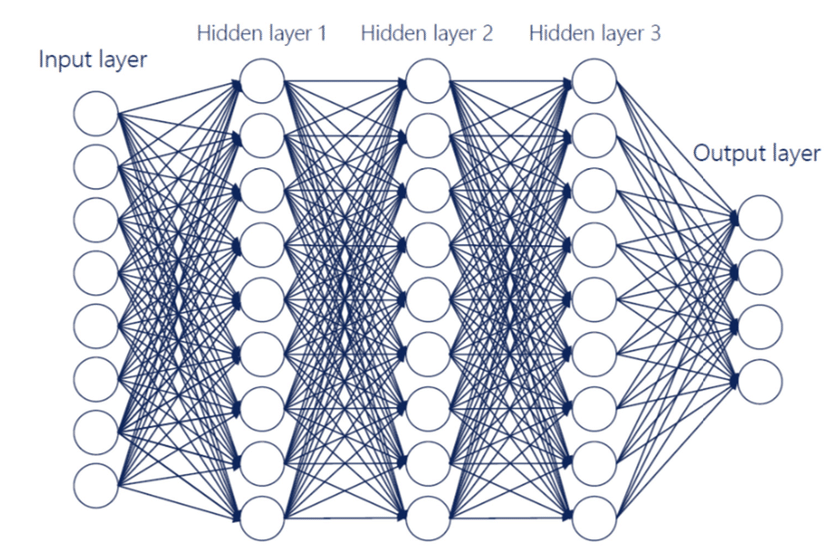

m4_include(../../../setup.m4)

# Lecture 25 - Our last "model" the DNN

Most of the time when I want to "predict" something from a set of inputs
what I want to do is recognize that there is "some" relationship between
the set of inputs and the set of outputs.

There are statical models for some of this like multiple linear regression.

Usually a machine learning model can do what the statistical models can do - only better.  It will produce a better "fit"
that just pure statistics.

The reason for this is that a machine learning model can be made to recognize "features" that are more complex than
just a linear input to output relationship.  To do this we need to make the model deeper - we need intermediate
layers for the more complex relationships.

The brain uses 6 or 7 layers in the pre-frontal cortex.  This gives you a range to work with.  Think 3 to 7 layers
will do most pattern matching.

Unlike our brain we can do more layers and more training - but - As we do this example I think that you will find 
that more layers may not be all that useful.


So the model will look something like:



let's walk through some code for  predicting gas millage based on horsepower, weight and other
inputs based on this.

```
m4_include(predict-milage.py.nu)
```
