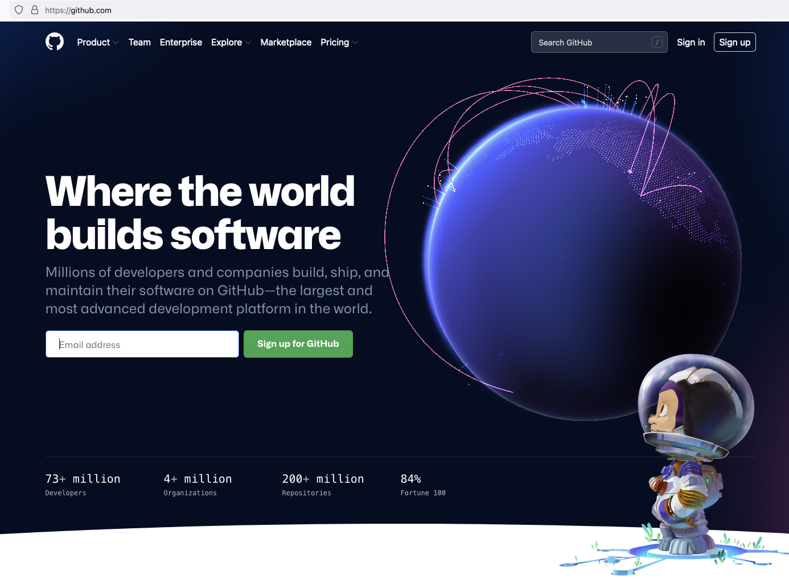
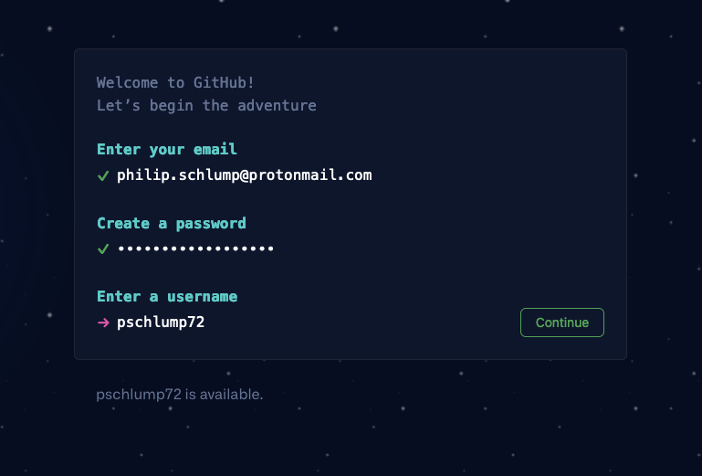

#  Lecture 27 - github.com with some code

## Setup Github.com 

Go to https://github.com

Step 000.  Click on the button to create an account.  The Green One that says `Sign up for GitHub`

Step 001.  You should get a prompt that looks kind of like a terminal prompt. That is the little red arrow.
Enter your email address.  Click `Continue` on the bottom right.

Step 002.  A password.  If you are using a password manager then generate a random password and use that.
If not then use random.org, [https://www.random.org/strings/](https://www.random.org/strings/)
to generate a password.  You will need to save the generated password in a file - you won't 
remember a random password.   When you use it later use cut/paste it from the file.
**Make backups of the file!  Print it out.  Save it in your sock drawer!  ALL computers
eventually crash - files get deleted.  Save it because if you loose it you will not
get it back.**   Change the number, check the boxes for Numeric, Upper lower case and
click the button at the bottom.   It should look like:

Now you should have a password to enter like, HVo9BcyMIoHD04J

Click `Continue` and give yourself a username that you like.

Step 003.  Solve a puzzle - so that only humans and  machine learning programs in python can login.

Step 004.  Get a checkbox and ... Yes click the big button at the bottom, `Create account`.

Step 005.  Now off to your email....  Have to confirm the email.

Step 006.  You should get an email that looks like this.  The number is a one time password.
The way that these work is it generates a secret, takes the secret - then uses the secret
to generate a password that lasts for a little while and sends that to you.   You enter
the number and that confirms to the system that the email address was real and you are
can login to it.

Step 007.

Step 008.

Step 009.

Step 010.

Step 011.

Step 012.

Step 013.

Step 014.

Step 015.

Step 016.

Step 017.

Step 018.

Step 019.

Step 020.

Step 021.

Step 022.

Step 023.

## Create our Python Project Code

## Modify It

## Checkin the result

## Capture Screen - to turn in for Lab

