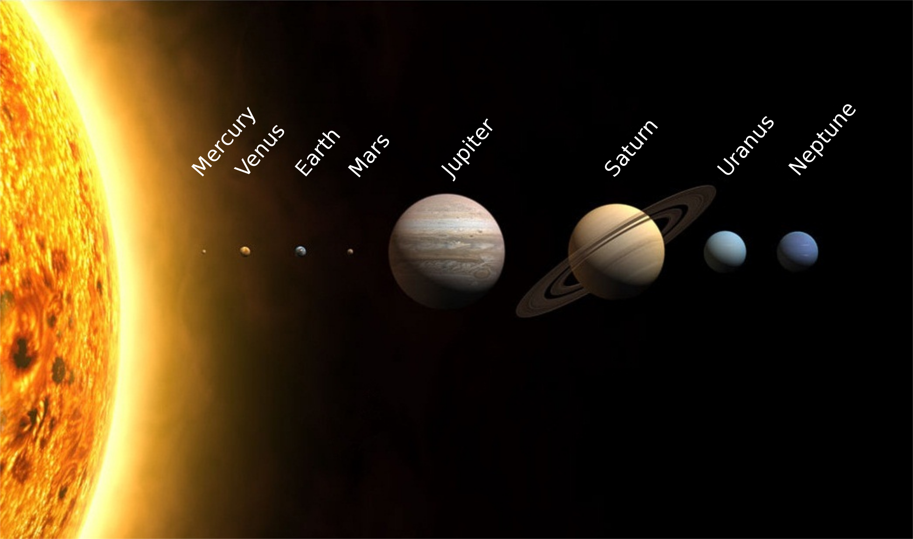

m4_include(../../setup.m4)

# Homework 2 - Distances to Planets and Stars

Due: Mon Feb 7

Points: 200 total. 
Turn in your code and the answers to the 6 questions.

# The Solar system and Exoplanets

Lots of you have seen models in school of the solar system.



[Image From Wikipedia!](https://creativecommons.org/licenses/by-sa/3.0/deed.en)  That is fun!!!

<div class="pagebreak"></div>

But very inaccurate.  Whenever you have a model you have 
inaccuracies.  That is not to say that it is not useful.
This is useful in showing the relative size and the order
of the planets in our solar system.

It is way, way, way off in giving you a sense of the scale of
the solar system.  In our model we will use the size
of a tennis ball as our model Sun and then calculate
the sizes of the planets and distances to other
stars.

For our calculations a tennis ball is 2.75 inches in diameter.
Note that some of our data is diameter and some is radius.
Diameter is radius times 2.

All of our calculations need to be carefully checked.  Read:
[https://www.simscale.com/blog/2017/12/nasa-mars-climate-orbiter-metric/](https://www.simscale.com/blog/2017/12/nasa-mars-climate-orbiter-metric/)
Unit conversion errors are a serious thing.  $125 million probe lost because of a conversion error between metric and English units.

## Sizes

The sizes of the planets in our solar system:

| Planet  | Radius                 | Description                                    |
|---------|:-----------------------|:-----------------------------------------------|
| Mercury | 1,516mi (2,440km)      | about 1/3 the size of Earth                    |
| Venus   | 3,760mi (6,052km)      | only slightly smaller than Earth               |
| Earth   | 3,959mi (6,371km)      | a nice place to live, about the size of Earth  |
| Mars    | 2,106mi (3,390km)      | about half the size of Earth                   |
| Jupiter | 43,441mi (69,911km)    | 11x Earth’s size                               |
| Saturn  | 36,184mi (58,232km)    | 9x larger than Earth                           |
| Uranus  | 15,759mi (25,362km)    | 4x Earth’s size                                |
| Neptune | 15,299mi (24,622km)    | only slightly smaller than Uranus              |

The Sun is 865,370 miles in diameter.

## Planet Distances from the Sun


| Planet   |    Distance from Sun (km)      | Distances from sun(miles) |
|----------|-------------------------------:|--------------------------:|
| Mercury  |    57,900,000                  |    35,977,481             |
| Venus    |    108,200,000                 |    67,232,530             |
| Earth    |    149,600,000                 |    92,957,361             |
| Mars     |    227,900,000                 |   141,610,847             |
| Jupiter  |    778,600,000                 |   483,800,813             |
| Saturn   |    1,433,500,000               |   890,737,818             |
| Uranus   |    2,872,500,000               | 1,784,893,186             |
| Neptune  |    4,495,100,000               | 2,793,132,589             |

## Conversion Factor

_To convert from the size in miles to tennis ball units (tb), divide the
miles by 
19,938,124,800.0_
.  This returns inches!  So if you get a
small value (like the size of earth) you will want to multiply by 1000
to get 1/1000th of an inch.  If you get a large value (like the distance
to a nearby star you will want to convert to miles)

m4_comment([[[ Conversion Factor  19938124800.0 ]]])
m4_comment([[[ Conversion Factor  19 938 124 800.0 ]]])

## Miles/Kilometers per Light Year

5,878,625,352,016,794 miles per light year.

## Conversions

To convert kilometers to miles multiply the miles by 0.62137119 .

To convert from miles to kilometers multiply by 1.60934 .

A mile is 80 chains, a chain is 22 yards.   A yard is 3 feet so a mile is 5280 feet.
An acre is 10 square chains.  All very convenient.  10 chains is 1 furlong.
so an acre is 1 furlong by 1 furlong.

## Learning Goals

1. Read in a value, calculate on it, print out results.
2. Testing of a program.
3. Printing out of results.
4. Debugging.
5. Use of a function in Python.
6. Editing text files.
7. What are files.
9. Organization of code.
10. Calculation with big numbers.
12. A model of how big the solar system is.

## Program

Write a program that will:

0. Create a directory/folder for this code
0. Bring up Visual Studio Code in a new directory.
```
$ mkdir hw2
$ cd hw2
```
Or Windows/PowerShell
```
H:\> H:
H:\> mkdir hw2
H:\> cd hw2
```
0. Open visual studio code, open the folder/directory hw2.  Edit the files.
1. use a "def" in `tb_to_inch.py` for the conversions
2. Have a test section at the bottom to test the function.
	- Write automated test code that will check that your conversion is correct.
	- Make it so that if you just run the conversion code it will run the test.
3. Run the test code - get this section to work.
4. Call the main program in the folder, `main.py`.
5. The main program will
	- `imort tb_to_inch`
	- Print out a prompt for the value, `print ( "Enter Miles" )`
	- Print out a prompt for the value, `input(miles_str)`
	- Convert to a number, `miles = float(miles_str)`
	- Apply a conversion from that unit to tennis ball model. (Call the function)
	- Output a value in miles, kilometers and feet plus inches (or fractions of an inch).

<div class="pagebreak"></div>

Example Code: from lecture...

main program (main.py)
```
m4_include(main.py)
```

main program (conv.py)
```
m4_include(conv.py)
```

Part 2. Use your program a few times.

## Questions: to be answer.

Questions are answered by doing a write up as a .md or .markdown (text) file in lab.
The write-up should be written in Visual Studio Code (VS Code).

Use markdown [https://www.markdownguide.org/cheat-sheet/](https://www.markdownguide.org/cheat-sheet/) for the formatting of your
text file answers.

This portion should be turned in as a part of your lab.

1. What is the closest star to planet Earth?  Think! It shines on you every day.
2. How many feet is it from the sun to earh (remember that the program prints out in inches).
3. How far is it from Earth to moon?
4. How many feet from sun to Saturn?
5. How big is Saturn in tennis ball units?
6. If the Sun in our model is the size of a tennis ball, then
	how far is to Proxima Centauri 4.3 light years from us?
	Calculate for our tennis ball model  the number of miles	
	that 4.3 light years represents.  Remember that the program
	returns inches, so you need to devide by 12, then by 5280
	to get miles.

Write up your answers in a text file , `homework2.txt` , using Visual Studio Code. (not Microsoft Word, or .pdf).

Turning your answers, and the code you developed and tested.


# Copyright

Copyright (C) University of Wyoming, 2021-2022.
